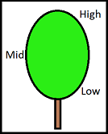

```{r setup, include=FALSE}
knitr::opts_chunk$set(echo = FALSE,cache = T)
library(xlsx)
library(ggplot2)
library(gplots)
library(gridExtra)
library(corrplot)
library(dplyr)
library(png)
library(grid)
library(heatmaply)
```


#### F1 Layout

Map indicates the layout of the F1 generation resulting from a cross between EC201 and EC103 parents. Column 1 is approximately lengthways facing north.

 

#### Height Diagram

Diagram indicates the areas of leaf collection regarding height.
Each Tree had 10 leaves collected, 3 from Low, 4 from Mid and 3 from High. The first leaf sampled was measured twice for replication comparison.




#### Import and Arrange Data

"Full.xlsx" contains measurement information from sampling with the Dualex (https://www.force-a.com/en/capteurs-optiques-optical-sensors/dualex-scientific-chlorophyll-meter/), including;

+ Surface content of chlorophyll in ?g/cm? (Chl) 

+ Epidermal Flavoid content in absorbance units; Flavonol(Flav) and Anthocyanin(Anth) 

+ Nitrogen Balance Index status (NBI)

It also contains information about the block position, the leaf height information, and presense or absence of flowering

Sheet "Dup" contains only the samples that were replicated.

```{r Data Import, echo = T}
# Import Data Measures
Data <-read.xlsx("Full.xlsx", sheetName ="Full")
head(Data)
Data$Column = as.factor(Data$Column)
Data$Row = as.factor(Data$Row)

# Import Replicate Data
Dup <-read.xlsx("Full.xlsx", sheetName ="Dup")
head(Dup)

#Isolate Crimson Glory Outgroup
CG = Data[c(1:11),]

#Isolate East Cape 201 Parent
EC201 = Data[c(12:21),]

#Isolate East Cape 103 Parent
EC103 = Data[c(22:33),]

#Isolate Offspring from the Parental Cross
F1 = Data[c(34:1825),]
```

#### Replicate Analysis

Replicates were taken by measuring a single leaf sample from each tree twice, in order to establish consistency and reliability of measurements with the Dualex.


##### Replicate Data Overview

```{r replicate means}
#Anthocyanin
RepAnth = summary(Dup$Anth)

#Chlorophyll
RepChl = summary(Dup$Chl)

#Flavanoid
RepFlav = summary(Dup$Flav)

#NBI
RepNBI =summary(Dup$NBI)

as.table(rbind(RepAnth,RepChl,RepFlav,RepNBI))
```

##### Replicate Group means

```{r}
Dup2 = group_by(Dup,Rep.)
Dup2 = summarise(Dup2, Anth = mean(Anth, na.rm = T),Chl = mean(Chl, na.rm = T), Flav = mean(Flav,na.rm = T), NBI = mean(NBI, na.rm = T))
head(Dup2)
```

##### Anthocyanin Replicate Plots

```{r Anth Replicate Plots}
#Anthocyanin Replicate Comparison
plot1<- ggplot(Dup) + aes(x = Rep., y = Anth,) + geom_boxplot(fill = "dodgerblue1", size = 1.25) + ylab("Anthocyanin Measure") + xlab("Replicate Number") + ggtitle("Anthocyanin of Replicate Samples") +stat_summary(fun.y=mean, colour="gray90", geom="point", shape=18, size=5) +theme_bw()+theme(plot.title = element_text(hjust = 0.5))+geom_hline(yintercept = mean(Dup$Anth));plot1

#Anth Mean Plot
plot11<-ggplot(Dup) +aes(x = Tree.ID, y = Anth) + geom_point(colour = "dodgerblue4") +geom_hline(yintercept = mean(Dup$Anth), colour = "dodgerblue1")+ ylab("Anthocyanin Measure") + xlab("Tree ID") + ggtitle("Anthocyanin of Replicate Samples")+theme_bw()+theme(plot.title = element_text(hjust = 0.5))

#Histogram of Measurement Distribution
plot12 <-ggplot(Dup) +aes(Anth,color=Rep., fill=Rep.) +geom_histogram(aes(y=..density..), alpha=0.5, position="identity")+ geom_density(alpha=.2) + ylab("Frequency") + xlab("Anthocyanin Absorbance Units") + ggtitle("Anthocyanin of Replicate Samples") +theme_bw() +theme(plot.title = element_text(hjust = 0.5))

#Display Plots
grid.arrange(plot11,plot12)
```
##### Chlorphyll Replicate Plots

```{r Chl Replicate Plots}
#Chlorophyll Replicate Comparison
plot2<- ggplot(Dup) + aes(x = Rep., y = Chl) + geom_boxplot(fill = "dodgerblue1", size = 1.25)+ ylab("Surface Chlorophyll") + xlab("Replicate Number") + ggtitle("Chlorophyll of Replicate Samples")+stat_summary(fun.y=mean, colour="gray90", geom="point", shape=18, size=5) +theme_bw()+theme(plot.title = element_text(hjust = 0.5))+geom_hline(yintercept = mean(Dup$Chl));plot2

#Chl Mean Plot
plot21 <-ggplot(Dup) +aes(x = Tree.ID, y = Chl, colour = Rep.,fill = Rep.) + geom_point() +geom_hline(yintercept = mean(Dup$Chl), colour = "dodgerblue1")+ ylab("Surface Chlorophyll") + xlab("Tree ID") + ggtitle("Chlorophyll of Replicate Samples")+theme_bw()+theme(plot.title = element_text(hjust = 0.5))

#Histogram of Chl Measurement Distribution
plot22 <-ggplot(Dup) +aes(Chl,color=Rep., fill=Rep.) +geom_histogram(aes(y=..density..), alpha=0.5, position="identity")+ geom_density(alpha=.2) + ylab("Frequency") + xlab("Surface Chlorophyll") + ggtitle("Chlorphyll of Replicate Samples") +theme_bw() +theme(plot.title = element_text(hjust = 0.5))

#Display Plots
grid.arrange(plot21,plot22)
```
##### Flavonol Replicate Plots

```{r Flav Replicate Plots}
#Flavonol Replicate Comparison
plot3<- ggplot(Dup) + aes(x = Rep., y = Flav) + geom_boxplot(fill = "dodgerblue1", size = 1.25)+ ylab("Surface Flavonol") + xlab("Replicate Number") + ggtitle("Flavonol of Replicate Samples")+stat_summary(fun.y=mean, colour="gray90", geom="point", shape=18, size=5) +theme_bw()+theme(plot.title = element_text(hjust = 0.5))+geom_hline(yintercept = mean(Dup$Flav));plot3

#Flav Mean Plot
plot31 <-ggplot(Dup) +aes(x = Tree.ID, y = Flav, colour = Rep.,fill = Rep.) + geom_point() +geom_hline(yintercept = mean(Dup$Flav), colour = "dodgerblue1")+ ylab("Surface Flavonol") + xlab("Tree ID") + ggtitle("Flavonol of Replicate Samples")+theme_bw()+theme(plot.title = element_text(hjust = 0.5))

#Histogram of Flav Measurement Distribution
plot32 <-ggplot(Dup) +aes(Flav,color=Rep., fill=Rep.) +geom_histogram(aes(y=..density..), alpha=0.5, position="identity")+ geom_density(alpha=.2) + ylab("Frequency") + xlab("Surface Flavonol") + ggtitle("Flavonol of Replicate Samples") +theme_bw() +theme(plot.title = element_text(hjust = 0.5))

#Display Plots
grid.arrange(plot31,plot32)
```
##### Nitrogen Balance Replicate Plots

```{r NBI Replicate Plots}
#Nitrogen Replicate Comparison
plot4<- ggplot(Dup) + aes(x = Rep., y = NBI) + geom_boxplot(fill = "dodgerblue1", size = 1.25)+ ylab("Surface Nitrogen") + xlab("Replicate Number") + ggtitle("Nitrogen of Replicate Samples")+stat_summary(fun.y=mean, colour="gray90", geom="point", shape=18, size=5) +theme_bw()+theme(plot.title = element_text(hjust = 0.5)) +geom_hline(yintercept = mean(Dup$NBI));plot4

#NBI Mean Plot
plot41 <-ggplot(Dup) +aes(x = Tree.ID, y = NBI, colour = Rep.,fill = Rep.) + geom_point() +geom_hline(yintercept = mean(Dup$NBI), colour = "dodgerblue1")+ ylab("Surface Nitrogen") + xlab("Tree ID") + ggtitle("Nitrogen of Replicate Samples")+theme_bw()+theme(plot.title = element_text(hjust = 0.5))

#Histogram of NBI Measurement Distribution
plot42 <-ggplot(Dup) +aes(NBI,color=Rep., fill=Rep.) +geom_histogram(aes(y=..density..), alpha=0.5, position="identity")+ geom_density(alpha=.2) + ylab("Frequency") + xlab("Surface Nitrogen") + ggtitle("Nitrogen of Replicate Samples") +theme_bw() +theme(plot.title = element_text(hjust = 0.5))

#Display Plots
grid.arrange(plot41,plot42)
```

There is no statistically significant differences between the two groups of measurements, this is a good sign indicative of the accuracy of the Dualex. 

##### ANOVA of Replicates

```{r}
#Chlorophyll Anova
mod <-lm(Dup$Chl ~ Dup$Rep.)
anova(mod)
#Flavanol Anova
mod2 <-lm(Dup$Flav ~ Dup$Rep.)
anova(mod2)
#Anthocyanin Anova
mod3 <-lm(Dup$Anth ~ Dup$Rep.)
anova(mod3)
#NBI Anova
mod4 <-lm(Dup$NBI ~ Dup$Rep.)
anova(mod4)
```

The absence of statistically significant results indicates that our replicates are likely to be consistent.


#### Allocation Analysis

Allocation refers to which group measurements were taken from, i.e. A Parental Tree (EC103 or EC201), Outgroup Tree (CG), Parental Offspring (F1)

```{r Allocation Means}
#Anthocyanin Mean
AllAnth = summary(Data$Anth)
#Chlorophyll Mean
AllChl = summary(Data$Chl)
#Flavanol Mean
AllFlav = summary(Data$Flav)
#NBI Mean
AllNBI = summary(Data$NBI)

as.table(rbind(AllAnth,AllChl,AllFlav,AllNBI))
```

##### Allocation Group Means

```{r}
Data2 = group_by(Data, Allocation)
Data2 = summarise(Data2, Anth = mean(Anth, na.rm = T),Chl = mean(Chl, na.rm = T), Flav = mean(Flav, na.rm = T), NBI = mean(NBI, na.rm = T))
head(Data2)
```

#### Boxplot comparing medians and measurement distributions

```{r Allocation Boxplots}
#Boxplot Anthocyanin Allocation
AAnth<- ggplot(Data) + aes(x = Allocation, y = Anth) + geom_boxplot(fill = "dodgerblue1", size = 1)+ ylab("Anth") + xlab("Allocation") + ggtitle("Anth of Allocations")+stat_summary(fun.y=mean, colour="green", geom="point", shape=18, size=3) +theme_bw()+theme(plot.title = element_text(hjust = 0.5)) +geom_hline(yintercept = mean(Data$Anth))

#Boxplot Chlorophyll Allocation
AChl<- ggplot(Data) + aes(x = Allocation, y = Chl) + geom_boxplot(fill = "dodgerblue1", size = 1)+ ylab("Chl") + xlab("Allocation") + ggtitle("Chl of Allocations")+stat_summary(fun.y=mean, colour="green", geom="point", shape=18, size=3) +theme_bw()+theme(plot.title = element_text(hjust = 0.5)) +geom_hline(yintercept = mean(Data$Chl))

#Boxplot Flavanol Allocation
AFlav<- ggplot(Data) + aes(x = Allocation, y = Flav) + geom_boxplot(fill = "dodgerblue1", size = 1)+ ylab("Flav") + xlab("Allocation") + ggtitle("Flav of Allocations")+stat_summary(fun.y=mean, colour="green", geom="point", shape=18, size=3) +theme_bw()+theme(plot.title = element_text(hjust = 0.5)) +geom_hline(yintercept = mean(Data$Flav))

#Boxplot NBI Allocation
ANBI<- ggplot(Data) + aes(x = Allocation, y = NBI) + geom_boxplot(fill = "dodgerblue1", size = 1)+ ylab("NBI") + xlab("Allocation") + ggtitle("NBI of Allocations")+stat_summary(fun.y=mean, colour="green", geom="point", shape=18, size=3) +theme_bw()+theme(plot.title = element_text(hjust = 0.5)) +geom_hline(yintercept = mean(Data$NBI))

#Display Plots
grid.arrange(AAnth,AChl,AFlav,ANBI, ncol=2)
```

##### ANOVAs

```{r Allocation Anova}
#Chlorophyll
mod5 <-lm(Data$Chl ~ Data$Allocation)
anova(mod5)
#Nitrogen
mod6 <-lm(Data$NBI ~ Data$Allocation)
anova(mod5)
#Flavanol
mod7 <-lm(Data$Flav ~ Data$Allocation)
anova(mod7)
#Anthocyanin
mod8 <-lm(Data$Anth ~ Data$Allocation)
anova(mod8)
```

F1 Samples (Approx 3 years) appear more similar to that of the Crimson Glory plant than either/both parents - this is possibly due to age effects as CG is likely more similar in this regard being shorter (No age confirmed).
ANOVAs incidate there is significant differences between the allocations - this is to be expected.


#### Parent Tree Analysis

```{r Parent t.tests}
#Binding parents into single dataset
Parent <- rbind(EC201,EC103)
#Summary Stats
Parent2 = group_by(Parent, Tree.ID)
Parent2 = summarise(Parent2,Anth = mean(Anth, na.rm = T),Chl = mean(Chl, na.rm = T), Flav = mean(Flav, na.rm = T), NBI = mean(NBI, na.rm = T))
head(Parent2)

#Anthocyanin
ParAnth = summary(Parent$Anth)
#Chlorophyll
ParChl = summary(Parent$Chl)
#Flavonol
ParFlav = summary(Parent$Flav)
#NBI
ParNBI = summary(Parent$NBI)

as.table(rbind(ParAnth,ParChl,ParFlav,ParNBI))
```
##### Anthocyanin Parent Plots

```{r Anth Parent Plots}
#Anthocyanin Parent Comparison
plot5<- ggplot(Parent) + aes(x = Tree.ID, y = Anth,) + geom_boxplot(fill = "dodgerblue1", size = 1.25) + ylab("Anthocyanin Measure") + xlab("Parent") + ggtitle("Anthocyanin of Parent Samples") +stat_summary(fun.y=mean, colour="gray90", geom="point", shape=18, size=5) +theme_bw()+theme(plot.title = element_text(hjust = 0.5))+geom_hline(yintercept = mean(Parent$Anth));plot1

#Anth Mean Plot
plot51<-ggplot(Parent) +aes(x = measure, y = Anth, colour = Tree.ID, fill = Tree.ID) + geom_point() +geom_hline(yintercept = mean(Parent$Anth), colour = "dodgerblue1")+ ylab("Anthocyanin") + xlab("Measure") + ggtitle("Anthocyanin of Parent Samples")+theme_bw()+theme(plot.title = element_text(hjust = 0.5))

#Histogram of Measurement Distribution
plot52 <-ggplot(Parent) +aes(Anth,color=Tree.ID, fill=Tree.ID) +geom_histogram(aes(y=..density..), alpha=0.5, position="identity")+ geom_density(alpha=.2) + ylab("Frequency") + xlab("Anthocyanin") + ggtitle("Anthocyanin Distribution of Parents") +theme_bw() +theme(plot.title = element_text(hjust = 0.5))

#Display Plots
grid.arrange(plot51,plot52)

#T.test
t.test(Parent$Anth ~ Parent$Tree.ID)
```


##### Chlorophyll Parent Plots

```{r Chl Parent Plots}
#Chlorophyll Parent Comparison
plot6<- ggplot(Parent) + aes(x = Tree.ID, y = Chl,) + geom_boxplot(fill = "dodgerblue1", size = 1.25) + ylab("Chlorophyll Measure") + xlab("Parent") + ggtitle("Chlorophyll of Parent Samples") +stat_summary(fun.y=mean, colour="gray90", geom="point", shape=18, size=5) +theme_bw()+theme(plot.title = element_text(hjust = 0.5))+geom_hline(yintercept = mean(Parent$Chl));plot1

#Chl Mean Plot
plot61<-ggplot(Parent) +aes(x = measure, y = Chl, colour = Tree.ID, fill = Tree.ID) + geom_point() +geom_hline(yintercept = mean(Parent$Chl), colour = "dodgerblue1")+ ylab("Chlorophyll") + xlab("Measure") + ggtitle("Chlorophyll of Parent Samples")+theme_bw()+theme(plot.title = element_text(hjust = 0.5))

#Histogram of Measurement Distribution
plot62 <-ggplot(Parent) +aes(Chl,color=Tree.ID, fill=Tree.ID) +geom_histogram(aes(y=..density..), alpha=0.5, position="identity")+ geom_density(alpha=.2) + ylab("Frequency") + xlab("Chlorophyll") + ggtitle("Chlorophyll Distribution of Parents") +theme_bw() +theme(plot.title = element_text(hjust = 0.5))

#Display Plots
grid.arrange(plot61,plot62)

t.test(Parent$Chl ~ Parent$Tree.ID)
```
##### Flavonol Parent Plots

```{r Flav Parent Plots}
#Flavonol Parent Comparison
plot7<- ggplot(Parent) + aes(x = Tree.ID, y = Flav,) + geom_boxplot(fill = "dodgerblue1", size = 1.25) + ylab("Flavonol Measure") + xlab("Parent") + ggtitle("Flavonol of Parent Samples") +stat_summary(fun.y=mean, colour="gray90", geom="point", shape=18, size=5) +theme_bw()+theme(plot.title = element_text(hjust = 0.5))+geom_hline(yintercept = mean(Parent$Flav));plot1

#Flav Mean Plot
plot71<-ggplot(Parent) +aes(x = measure, y = Flav, colour = Tree.ID, fill = Tree.ID) + geom_point() +geom_hline(yintercept = mean(Parent$Flav), colour = "dodgerblue1")+ ylab("Flavonol") + xlab("Measure") + ggtitle("Flavonol of Parent Samples")+theme_bw()+theme(plot.title = element_text(hjust = 0.5))

#Histogram of Measurement Distribution
plot72 <-ggplot(Parent) +aes(Flav,color=Tree.ID, fill=Tree.ID) +geom_histogram(aes(y=..density..), alpha=0.5, position="identity")+ geom_density(alpha=.2) + ylab("Frequency") + xlab("Flavonol") + ggtitle("Flavonol Distribution of Parents") +theme_bw() +theme(plot.title = element_text(hjust = 0.5))

#Display Plots
grid.arrange(plot71,plot72)

t.test(Parent$Flav ~ Parent$Tree.ID)
```
##### Nitrogen Parent Plots

```{r NBI Parent Plots}
#Nitrogen Parent Comparison
plot8<- ggplot(Parent) + aes(x = Tree.ID, y = NBI,) + geom_boxplot(fill = "dodgerblue1", size = 1.25) + ylab("Nitrogen Measure") + xlab("Parent") + ggtitle("Nitrogen of Parent Samples") +stat_summary(fun.y=mean, colour="gray90", geom="point", shape=18, size=5) +theme_bw()+theme(plot.title = element_text(hjust = 0.5))+geom_hline(yintercept = mean(Parent$NBI));plot1

#NBI Mean Plot
plot81<-ggplot(Parent) +aes(x = measure, y = NBI, colour = Tree.ID, fill = Tree.ID) + geom_point() +geom_hline(yintercept = mean(Parent$NBI), colour = "dodgerblue1")+ ylab("Nitrogen") + xlab("Measure") + ggtitle("Nitrogen of Parent Samples")+theme_bw()+theme(plot.title = element_text(hjust = 0.5))

#Histogram of Measurement Distribution
plot82 <-ggplot(Parent) +aes(NBI,color=Tree.ID, fill=Tree.ID) +geom_histogram(aes(y=..density..), alpha=0.5, position="identity")+ geom_density(alpha=.2) + ylab("Frequency") + xlab("Nitrogen") + ggtitle("Nitrogen Distribution of Parents") +theme_bw() +theme(plot.title = element_text(hjust = 0.5))

#Display Plots
grid.arrange(plot81,plot82)

t.test(Parent$NBI ~ Parent$Tree.ID)
```

Interesting sample pattern here, Chl and NBI start low and work high, Flav does the opposite. Maybe accuracy of measurements? 


#### Parental Cross Analysis (F1 Generation)

Investigating measures across the F1 cross population

```{r F1}
#Grouping F1 Measures By Tree
F12 <-group_by(F1,Tree.ID)
F12 <- summarise(F12,Chl = mean(Chl,na.rm=T), NBI = mean(NBI, ra.nm = T), Anth = mean(Anth, na.rm=T),Flav = mean(Flav,na.rm =T))
head(F12)
```


##### Anthocyanin Overview

```{r F1 Anth}
#Anthocyanin F1 Comparison
FAnth<- ggplot(F1) + aes(x = Tree.ID, y = Anth,) + geom_boxplot(colour = "turquoise4") + ylab("Anthocyanin Measure") + xlab("F1") + ggtitle("Anthocyanin of F1 Samples") +theme_bw()+theme(plot.title = element_text(hjust = 0.5))+geom_hline(yintercept = mean(F1$Anth), colour = "orchid3");FAnth

#Anth Mean Plot
FMAnth<-ggplot(F12) +aes(x = Tree.ID, y = Anth) + geom_point(colour = "turquoise3") +geom_hline(yintercept = mean(F12$Anth), colour = "orchid3")+ ylab("Anthocyanin") + xlab("Tree ID") + ggtitle("Anthocyanin of F1 Samples")+theme_bw()+theme(plot.title = element_text(hjust = 0.5))

#Histogram of Measurement Distribution
HAnth <-ggplot(F12) +aes(Anth) +geom_histogram(aes(y=..density..), alpha=0.5, position="identity",colour = "turquoise3",fill ="turquoise1" )+ geom_density(alpha=.2,colour = "orchid1",fill = "orchid3") + ylab("Frequency") + xlab("Anthocyanin") + ggtitle("Anthocyanin Distribution of F1") +theme_bw() +theme(plot.title = element_text(hjust = 0.5))

#Display Plots
grid.arrange(FMAnth,HAnth)

#Anthocyanin ANOVA
FAA = lm(F1$Anth ~ F1$Tree.ID)
anova(FAA)
```

##### Chlorophyll Overview

```{r F1 Chl}
#Chlorophyll F1 Comparison
FChl<- ggplot(F1) + aes(x = Tree.ID, y = Chl,) + geom_boxplot(colour = "turquoise4") + ylab("Chlorophyll Measure") + xlab("F1") + ggtitle("Chlorophyll of F1 Samples") +theme_bw()+theme(plot.title = element_text(hjust = 0.5))+geom_hline(yintercept = mean(F1$Chl), colour = "orchid3");FChl

#Chl Mean Plot
FMChl<-ggplot(F12) +aes(x = Tree.ID, y = Chl) + geom_point(colour = "turquoise3") +geom_hline(yintercept = mean(F12$Chl), colour = "orchid3")+ ylab("Chlorophyll") + xlab("Tree ID") + ggtitle("Chlorophyll of F1 Samples")+theme_bw()+theme(plot.title = element_text(hjust = 0.5))

#Histogram of Measurement Distribution
HChl <-ggplot(F12) +aes(Chl) +geom_histogram(aes(y=..density..), alpha=0.5, position="identity",colour = "turquoise3",fill ="turquoise1" )+ geom_density(alpha=.2,colour = "orchid1",fill = "orchid3") + ylab("Frequency") + xlab("Chlorophyll") + ggtitle("Chlorophyll Distribution of F1") +theme_bw() +theme(plot.title = element_text(hjust = 0.5))

#Display Plots
grid.arrange(FMChl,HChl)

#Chlorophyll ANOVA
FAA = lm(F1$Chl ~ F1$Tree.ID)
anova(FAA)
```

##### Flavonol Overview

```{r F1 Flav}
#Flavonol F1 Comparison
FFlav<- ggplot(F1) + aes(x = Tree.ID, y = Flav,) + geom_boxplot(colour = "turquoise4") + ylab("Flavonol Measure") + xlab("F1") + ggtitle("Flavonol of F1 Samples") +theme_bw()+theme(plot.title = element_text(hjust = 0.5))+geom_hline(yintercept = mean(F1$Flav), colour = "orchid3");FFlav

#Flav Mean Plot
FMFlav<-ggplot(F12) +aes(x = Tree.ID, y = Flav) + geom_point(colour = "turquoise3") +geom_hline(yintercept = mean(F12$Flav), colour = "orchid3")+ ylab("Flavonol") + xlab("Tree ID") + ggtitle("Flavonol of F1 Samples")+theme_bw()+theme(plot.title = element_text(hjust = 0.5))

#Histogram of Measurement Distribution
HFlav <-ggplot(F12) +aes(Flav) +geom_histogram(aes(y=..density..), alpha=0.5, position="identity",colour = "turquoise3",fill ="turquoise1" )+ geom_density(alpha=.2,colour = "orchid1",fill = "orchid3") + ylab("Frequency") + xlab("Flavonol") + ggtitle("Flavonol Distribution of F1") +theme_bw() +theme(plot.title = element_text(hjust = 0.5))

#Display Plots
grid.arrange(FMFlav,HFlav)

#Flavonol ANOVA
FAA = lm(F1$Flav ~ F1$Tree.ID)
anova(FAA)
```

##### Nitrogen Overview

```{r F1 NBI}
#Nitrogen F1 Comparison
FNBI<- ggplot(F1) + aes(x = Tree.ID, y = NBI,) + geom_boxplot(colour = "turquoise4") + ylab("Nitrogen Measure") + xlab("F1") + ggtitle("Nitrogen of F1 Samples") +theme_bw()+theme(plot.title = element_text(hjust = 0.5))+geom_hline(yintercept = mean(F1$NBI), colour = "orchid3");FNBI

#NBI Mean Plot
FMNBI<-ggplot(F12) +aes(x = Tree.ID, y = NBI) + geom_point(colour = "turquoise3") +geom_hline(yintercept = mean(F12$NBI), colour = "orchid3")+ ylab("Nitrogen") + xlab("Tree ID") + ggtitle("Nitrogen of F1 Samples")+theme_bw()+theme(plot.title = element_text(hjust = 0.5))

#Histogram of Measurement Distribution
HNBI <-ggplot(F12) +aes(NBI) +geom_histogram(aes(y=..density..), alpha=0.5, position="identity",colour = "turquoise3",fill ="turquoise1" )+ geom_density(alpha=.2,colour = "orchid1",fill = "orchid3") + ylab("Frequency") + xlab("Nitrogen") + ggtitle("Nitrogen Distribution of F1") +theme_bw() +theme(plot.title = element_text(hjust = 0.5))

#Display Plots
grid.arrange(FMNBI,HNBI)

#Nitrogen ANOVA
FAA = lm(F1$NBI ~ F1$Tree.ID)
anova(FAA)
```

#### A Closer Look at Invidual Trees and Their Measurements


```{r investigating measure numbers of random samples}
Msr = group_by(F1, Tree.ID, measure)
Msr = summarise(Msr, Anth = mean(Anth), Flav = mean(Flav), Chl = mean(Chl),NBI = mean(NBI))

#Select Random Column
#sample(1:4,10, replace = T)
#[1] 3 3 2 1 1 4 1 2 4 3

#Select Random Row
#sample(1:50,10, replace = T)
#[1] 34 37 44 20 44 47  9 19 22 40

#Col 3, Row 34 = IN4G5
IN4G5 = Msr[c(1432:1442),]
AnthG5 <-ggplot(IN4G5) + aes(x = measure, y = Anth) + geom_point() + geom_hline(yintercept = mean(IN4G5$Anth))
ChlG5 <-ggplot(IN4G5) + aes(x = measure, y = Chl) + geom_point() + geom_hline(yintercept = mean(IN4G5$Chl))
FlavG5 <-ggplot(IN4G5) + aes(x = measure, y = Flav) + geom_point() + geom_hline(yintercept = mean(IN4G5$Flav))
NBIG5 <-ggplot(IN4G5) + aes(x = measure, y = NBI) + geom_point() + geom_hline(yintercept = mean(IN4G5$NBI))
grid.arrange(AnthG5,ChlG5,FlavG5,NBIG5)

#Col 3, Row 37 = IN4EP
IN4EP = Msr[c(935:945),]
AnthEP <-ggplot(IN4EP) + aes(x = measure, y = Anth) + geom_point() + geom_hline(yintercept = mean(IN4EP$Anth))
ChlEP <-ggplot(IN4EP) + aes(x = measure, y = Chl) + geom_point() + geom_hline(yintercept = mean(IN4EP$Chl))
FlavEP <-ggplot(IN4EP) + aes(x = measure, y = Flav) + geom_point() + geom_hline(yintercept = mean(IN4EP$Flav))
NBIEP <-ggplot(IN4EP) + aes(x = measure, y = NBI) + geom_point() + geom_hline(yintercept = mean(IN4EP$NBI))
grid.arrange(AnthEP,ChlEP,FlavEP,NBIEP)

#Col 2, Row 44 = IN4EY
IN4EY = Msr[c(1012:1022),]
AnthEY <-ggplot(IN4EY) + aes(x = measure, y = Anth) + geom_point() + geom_hline(yintercept = mean(IN4EY$Anth))
ChlEY <-ggplot(IN4EY) + aes(x = measure, y = Chl) + geom_point() + geom_hline(yintercept = mean(IN4EY$Chl))
FlavEY <-ggplot(IN4EY) + aes(x = measure, y = Flav) + geom_point() + geom_hline(yintercept = mean(IN4EY$Flav))
NBIEY <-ggplot(IN4EY) + aes(x = measure, y = NBI) + geom_point() + geom_hline(yintercept = mean(IN4EY$NBI))
grid.arrange(AnthEY,ChlEY,FlavEY,NBIEY)

#Col 1, Row 20 = IN4CD
IN4CD = Msr[c(204:214),]
AnthCD <-ggplot(IN4CD) + aes(x = measure, y = Anth) + geom_point() + geom_hline(yintercept = mean(IN4CD$Anth))
ChlCD <-ggplot(IN4CD) + aes(x = measure, y = Chl) + geom_point() + geom_hline(yintercept = mean(IN4CD$Chl))
FlavCD <-ggplot(IN4CD) + aes(x = measure, y = Flav) + geom_point() + geom_hline(yintercept = mean(IN4CD$Flav))
NBICD <-ggplot(IN4CD) + aes(x = measure, y = NBI) + geom_point() + geom_hline(yintercept = mean(IN4CD$NBI))
grid.arrange(AnthCD,ChlCD,FlavCD,NBICD)

#Col 1, Row 44 = IN4D8
IN4D8 = Msr[c(463:472),]
AnthD8 <-ggplot(IN4D8) + aes(x = measure, y = Anth) + geom_point() + geom_hline(yintercept = mean(IN4D8$Anth))
ChlD8 <-ggplot(IN4D8) + aes(x = measure, y = Chl) + geom_point() + geom_hline(yintercept = mean(IN4D8$Chl))
FlavD8 <-ggplot(IN4D8) + aes(x = measure, y = Flav) + geom_point() + geom_hline(yintercept = mean(IN4D8$Flav))
NBID8 <-ggplot(IN4D8) + aes(x = measure, y = NBI) + geom_point() + geom_hline(yintercept = mean(IN4D8$NBI))
grid.arrange(AnthD8,ChlD8,FlavD8,NBID8)

#Col4, Row 47 = IN4GV
IN4GV = Msr[c(1645:1654),]
AnthGV <-ggplot(IN4GV) + aes(x = measure, y = Anth) + geom_point() + geom_hline(yintercept = mean(IN4GV$Anth))
ChlGV <-ggplot(IN4GV) + aes(x = measure, y = Chl) + geom_point() + geom_hline(yintercept = mean(IN4GV$Chl))
FlavGV <-ggplot(IN4GV) + aes(x = measure, y = Flav) + geom_point() + geom_hline(yintercept = mean(IN4GV$Flav))
NBIGV <-ggplot(IN4GV) + aes(x = measure, y = NBI) + geom_point() + geom_hline(yintercept = mean(IN4GV$NBI))
grid.arrange(AnthGV,ChlGV,FlavGV,NBIGV)

#Col 1, Row 9 = IN4C2
IN4C2 = Msr[c(93:103),]
AnthC2 <-ggplot(IN4C2) + aes(x = measure, y = Anth) + geom_point() + geom_hline(yintercept = mean(IN4C2$Anth))
ChlC2 <-ggplot(IN4C2) + aes(x = measure, y = Chl) + geom_point() + geom_hline(yintercept = mean(IN4C2$Chl))
FlavC2 <-ggplot(IN4C2) + aes(x = measure, y = Flav) + geom_point() + geom_hline(yintercept = mean(IN4C2$Flav))
NBIC2 <-ggplot(IN4C2) + aes(x = measure, y = NBI) + geom_point() + geom_hline(yintercept = mean(IN4C2$NBI))
grid.arrange(AnthC2,ChlC2,FlavC2,NBIC2)

#Col 2, Row 19 = IN4E3
IN4E3 = Msr[c(740:750),]
AnthE3 <-ggplot(IN4E3) + aes(x = measure, y = Anth) + geom_point() + geom_hline(yintercept = mean(IN4E3$Anth))
ChlE3 <-ggplot(IN4E3) + aes(x = measure, y = Chl) + geom_point() + geom_hline(yintercept = mean(IN4E3$Chl))
FlavE3 <-ggplot(IN4E3) + aes(x = measure, y = Flav) + geom_point() + geom_hline(yintercept = mean(IN4E3$Flav))
NBIE3 <-ggplot(IN4E3) + aes(x = measure, y = NBI) + geom_point() + geom_hline(yintercept = mean(IN4E3$NBI))
grid.arrange(AnthE3,ChlE3,FlavE3,NBIE3)

#Col 4, Row 22 = N/A -> Row 23 = IN4HK
IN4HK = Msr[c(1718:1728),]
AnthHK <-ggplot(IN4HK) + aes(x = measure, y = Anth) + geom_point() + geom_hline(yintercept = mean(IN4HK$Anth))
ChlHK <-ggplot(IN4HK) + aes(x = measure, y = Chl) + geom_point() + geom_hline(yintercept = mean(IN4HK$Chl))
FlavHK <-ggplot(IN4HK) + aes(x = measure, y = Flav) + geom_point() + geom_hline(yintercept = mean(IN4HK$Flav))
NBIHK <-ggplot(IN4HK) + aes(x = measure, y = NBI) + geom_point() + geom_hline(yintercept = mean(IN4HK$NBI))
grid.arrange(AnthHK,ChlHK,FlavHK,NBIHK)

#Col 3, Row 40 = IN4GC
IN4GC = Msr[c(1508:1518),]
AnthGC <-ggplot(IN4GC) + aes(x = measure, y = Anth) + geom_point() + geom_hline(yintercept = mean(IN4GC$Anth))
ChlGC <-ggplot(IN4GC) + aes(x = measure, y = Chl) + geom_point() + geom_hline(yintercept = mean(IN4GC$Chl))
FlavGC <-ggplot(IN4GC) + aes(x = measure, y = Flav) + geom_point() + geom_hline(yintercept = mean(IN4GC$Flav))
NBIGC <-ggplot(IN4GC) + aes(x = measure, y = NBI) + geom_point() + geom_hline(yintercept = mean(IN4GC$NBI))
grid.arrange(AnthGC,ChlGC,FlavGC,NBIGC)
```

#### Height Analysis

```{r Height Analysis}
F13 = group_by(F1,Height)
F13 = summarise(F13, Anth = mean(Anth, na.rm = T), Chl = mean(Chl, na.rm = T), Flav = mean(Flav, na.rm = T), NBI = mean(NBI, na.rm = T))
head(F13)

#Boxplot Anthocyanin Height
HAnth <- ggplot(F1) + aes(x = Height, y = Anth) + geom_boxplot() +geom_hline(yintercept = mean(F1$Anth), color = "purple4") + ylab("Anthocyanin Measure") + xlab("Height") + ggtitle("Anthocyanin of F1 population by Height") + theme_classic()+stat_summary(fun.y=mean, colour="darkred", geom="point", shape=18, size=3)

#Boxplot Chlorophyll F1
HChl <- ggplot(F1) + aes(x = Height, y = Chl) + geom_boxplot() +geom_hline(yintercept = mean(F1$Chl), color = "purple4") + ylab("Chlorophyll Measure") + xlab("Height") + ggtitle("Chlorophyll of F1 Population") + theme_classic() +stat_summary(fun.y=mean, colour="darkred", geom="point", shape=18, size=3)

#Boxplot Flavanol F1
HFlav <- ggplot(F1) + aes(x = Height, y = Flav) + geom_boxplot() +geom_hline(yintercept = mean(F1$Flav), color = "purple4") + ylab("Flavanol Measure") + xlab("Height") + ggtitle("Flavonol of F1 Population by Height") + theme_classic() +stat_summary(fun.y=mean, colour="darkred", geom="point", shape=18, size=3)

#Boxplot NBI F1
HNBI <- ggplot(F1) + aes(x = Height, y = NBI) + geom_boxplot() +geom_hline(yintercept = mean(F1$NBI), color = "purple4") + ylab("NBI Measure") + xlab("Height") + ggtitle("NBI of F1 Population") + theme_classic() +stat_summary(fun.y=mean, colour="darkred", geom="point", shape=18, size=3)
grid.arrange(HAnth,HChl,HFlav,HNBI)
```

```{r Height Anova}
#Anthocyanin ANOVA
HAA = lm(F1$Anth ~ F1$Height)
anova(HAA)
summary(HAA)
#Chlorophyll ANOVA
HCA = lm(F1$Chl ~ F1$Height)
anova(HCA)

#Flavonol ANOVA
HFA = lm(F1$Flav ~ F1$Height)
anova(HFA)

#NBI ANOVA
HNA = lm(F1$NBI ~ F1$Height)
anova(HNA)
```

#### Row Analysis

```{r Row Analysis}
#Grouping data by ROw
F1R = group_by(F1,Row)
F1R = summarise(F1R,Chl = mean(Chl,na.rm=T), NBI = mean(NBI, ra.nm = T), Anth = mean(Anth, na.rm=T),Flav = mean(Flav,na.rm =T))
head(F1R)

#Comparing Rows with Differing Tree Numbers

#1 Row with 2 Trees
R2 = F1R[c(9),]
#39 Rows with 3 Trees
R3 = F1R[-c(16,26,4,40,36,5,50,42,44,46,9),]
#10  Rows with 4 Trees
R4 = F1R[c(16,26,4,40,36,5,50,42,44,46),]

#Row Sample Summaries
summary(R2)
summary(R3)
summary(R4)

#Checking Variance (R2 discounted due to sample size of 1 row)
var(R3$Anth)
var(R4$Anth)
var(R3$Chl)
var(R4$Chl)
var(R3$Flav)
var(R4$Flav)
var(R3$NBI)
var(R4$NBI)


#T.test 
t.test(R4$Anth, R3$Anth, alternative = "two.sided", var.equal = FALSE)
t.test(R4$Chl, R3$Chl, alternative = "two.sided", var.equal = FALSE)
t.test(R4$Flav, R3$Flav, alternative = "two.sided", var.equal = FALSE)
t.test(R4$Flav, R3$Flav, alternative = "two.sided", var.equal = FALSE)
```

There appears to be no signficant differences between Rows with 3 trees and rows with 4 trees for any of the measures. 

#### Row Plots and ANOVAs

```{r}
#Boxplot Anthocyanin Row
RoAnth <- ggplot(F1) + aes(x = Row, y = Anth) + geom_boxplot() +geom_hline(yintercept = mean(F1$Anth), color = "purple4") + ylab("Anthocyanin Measure") + xlab("Row") + ggtitle("Anthocyanin of F1 population by Row") + theme_classic();RoAnth
#Mean Anthocyanin Row Plot
SRoAnth <- ggplot(F1R) + aes(x = as.numeric(Row), y = Anth) + geom_point() +geom_hline(yintercept = mean(F1R$Anth)) + ylab("Anthocyanin Measure") + xlab("Row") + ggtitle("Mean Anthocyanin of F1 population by Row") + theme_classic()
#Histogram of Anthocyanin
RoHAnth <- ggplot(F1R) + aes(x = Anth) + geom_histogram()
#Display plots
grid.arrange(SRoAnth,RoHAnth)
#Anthocyanin ANOVA
RoAA = lm(F1$Anth ~ F1$Row)
anova(RoAA)

#Boxplot Chlorophyll F1
RoChl <- ggplot(F1) + aes(x = Row, y = Chl) + geom_boxplot() +geom_hline(yintercept = mean(F1$Chl), color = "purple4") + ylab("Chlorophyll Measure") + xlab("Row") + ggtitle("Chlorophyll of F1 Population by Row") + theme_classic();RoChl
#Mean Chlorophyll Row Plot
SRoChl <- ggplot(F1R) + aes(x = as.numeric(Row), y = Chl) + geom_point() +geom_hline(yintercept = mean(F1R$Chl)) + ylab("Chlorophyll Measure") + xlab("Row") + ggtitle("Mean Chl of F1 population by Row") + theme_classic()
#Histogram of Chlorophyll
RoHChl <- ggplot(F1R) + aes(x = Chl) + geom_histogram()
#Display plots
grid.arrange(SRoChl,RoHChl)
#Anthocyanin ANOVA
RoCA = lm(F1$Chl ~ F1$Row)
anova(RoCA)

#Boxplot Flavanol F1
RoFlav <- ggplot(F1) + aes(x = Row, y = Flav) + geom_boxplot() +geom_hline(yintercept = mean(F1$Flav), color = "purple4") + ylab("Flavanol Measure") + xlab("Row") + ggtitle("Flavonol of F1 Population by Row") + theme_classic();RoFlav
#Mean Flavonol Row Plot
SRoFlav <- ggplot(F1R) + aes(x = as.numeric(Row), y = Flav) + geom_point() +geom_hline(yintercept = mean(F1R$Flav)) + ylab("Flavonol Measure") + xlab("Row") + ggtitle("Mean Flavonol of F1 population by Row") + theme_classic()
#Histogram of Flavonol
RoHFlav <- ggplot(F1R) + aes(x = Flav) + geom_histogram()
#Display plots
grid.arrange(SRoFlav,RoHFlav)
#Anthocyanin ANOVA
RoFA = lm(F1$Flav ~ F1$Row)
anova(RoFA)

#Boxplot NBI F1
RoNBI <- ggplot(F1) + aes(x = Row, y = NBI) + geom_boxplot() +geom_hline(yintercept = mean(F1$NBI), color = "purple4") + ylab("NBI Measure") + xlab("Row") + ggtitle("NBI of F1 Population by Row") + theme_classic();RoNBI
#Mean NBI Row Plot
SRoNBI <- ggplot(F1R) + aes(x = as.numeric(Row), y = NBI) + geom_point() +geom_hline(yintercept = mean(F1R$NBI)) + ylab("NBI Measure") + xlab("Row") + ggtitle("Mean NBI of F1 population by Row") + theme_classic()
#Histogram of NBI
RoHNBI <- ggplot(F1R) + aes(x = NBI) + geom_histogram()
#Display plots
grid.arrange(SRoNBI,RoHNBI)
#Anthocyanin ANOVA
RoNA = lm(F1$NBI ~ F1$Row)
anova(RoNA)
```

#### Column Analysis

```{r Column Analysis}
#Making Column Values Factors
F1$Column = as.factor(F1$Column)
#Grouping data by Column
F1C = group_by(F1,Column)
F1C = summarise(F1C,Chl = mean(Chl,na.rm=T), NBI = mean(NBI, ra.nm = T), Anth = mean(Anth, na.rm=T),Flav = mean(Flav,na.rm =T))
head(F1C)
 
#Boxplot Anthocyanin Height
CAnth <- ggplot(F1) + aes(x = Column, y = Anth) + geom_boxplot() +geom_hline(yintercept = mean(F1$Anth)) + ylab("Anthocyanin Measure") + xlab("Column") + ggtitle("Anthocyanin of F1 population by Column") + theme_classic() +stat_summary(fun.y=mean, colour="darkred", geom="point", shape=18, size=3)

#Anthocyanin ANOVA
CAA = lm(F1$Anth ~ F1$Column)
anova(CAA)

#Boxplot Chlorophyll F1
CChl <- ggplot(F1) + aes(x = Column, y = Chl) + geom_boxplot() +geom_hline(yintercept = mean(F1$Chl), color = "purple4") + ylab("Chlorophyll Measure") + xlab("Column") + ggtitle("Chlorophyll of F1 Population by Column") + theme_classic()+stat_summary(fun.y=mean, colour="darkred", geom="point", shape=18, size=3)

#Chlorophyll ANOVA
CCA = lm(F1$Chl ~ F1$Column)
anova(CCA)

#Boxplot Flavanol F1
CFlav <- ggplot(F1) + aes(x = Column, y = Flav) + geom_boxplot() +geom_hline(yintercept = mean(F1$Flav), color = "purple4") + ylab("Flavanol Measure") + xlab("Column") + ggtitle("Flavonol of F1 Population by Column") + theme_classic() +stat_summary(fun.y=mean, colour="darkred", geom="point", shape=18, size=3)

#Flavonol ANOVA
CFA = lm(F1$Flav ~ F1$Column)
anova(CFA)

#Boxplot NBI F1
CNBI <- ggplot(F1) + aes(x = Column, y = NBI) + geom_boxplot() +geom_hline(yintercept = mean(F1$NBI), color = "purple4") + ylab("NBI Measure") + xlab("Column") + ggtitle("NBI of F1 Population by Column") + theme_classic() +stat_summary(fun.y=mean, colour="darkred", geom="point", shape=18, size=3)
#NBI ANOVA
CNA = lm(F1$NBI ~ F1$Column)
anova(CNA)

grid.arrange(CAnth,CChl,CFlav,CNBI)
```

```{r interactive terms}
#Anthocyanin
CRHA = lm(F1$Anth ~ F1$Height*F1$Column*F1$Row)
anova(CRHA)
#Remove insignificant variables
CRHA2 = lm(F1$Anth ~ F1$Height*F1$Row)
anova(CRHA2)
#Chlorophyll
CRHC = lm(F1$Chl ~ F1$Height*F1$Column*F1$Row)
anova(CRHC)
#Remove insignificant variables
CRHC2 = lm(F1$Chl ~ F1$Height*F1$Row)
anova(CRHC2)
#Further Remove insignificant variables
CRHC3 = lm(F1$Chl ~ F1$Row)
anova(CRHC3)

#Flavonol
CRHF = lm(F1$Flav ~ F1$Height*F1$Column*F1$Row)
anova(CRHF)

#NBI
CRHN = lm(F1$NBI ~ F1$Height*F1$Column*F1$Row)
anova(CRHN)
#Remove insignificant variables
CRHM2 = lm(F1$NBI ~ F1$Row*F1$Column)
anova(CRHM2)
```

Controlling for Height,Column,Row effects 

```{r}
Dat = F1
#Total Mean
Dat$ATmean = mean(Dat$Anth)
Dat$CTmean = mean(Dat$Chl)
Dat$FTmean = mean(Dat$Flav)
Dat$NTmean = mean(Dat$NBI)

#Remove Total Mean
Dat$Anth2 = Dat$Anth - Dat$ATmean
Dat$Chl2 = Dat$Chl - Dat$CTmean
Dat$Flav2 = Dat$Flav - Dat$FTmean
Dat$NBI2 = Dat$NBI - Dat$NTmean

#Height Mean
DatH = group_by(Dat, Height)
DatH = summarise(DatH, HAnth = mean(Anth, na.rm = T), HFlav = mean(Flav,na.rm = T))

#Add Height Mean to Data
Dat =merge(Dat, DatH, by.x = "Height")

#Calculate Height Mean Deviation from Total Mean 
Dat$ATH <- Dat$ATmean - Dat$HAnth
Dat$FTH = Dat$FTmean - Dat$HFlav

#Controlling for Height Anth and Flav
Dat$Anth3 = Dat$Anth2 + Dat$ATH
Dat$Flav3 = Dat$Flav2 + Dat$FTH

#Column Mean
DatC = group_by(Dat, Column)
DatC = summarise(DatC, CFlav = mean(Flav,na.rm = T), CNBI = mean(NBI,na.rm = T))

#Add Height Mean to Data
Dat =merge(Dat, DatC, by.x = "Column")

#Calculate Height Mean Deviation from Total Mean 
Dat$FTH = Dat$FTmean - Dat$CFlav
Dat$NTH = Dat$NTmean - Dat$CNBI

#Controlling for Column Flav and NBI
Dat$Flav4 = Dat$Flav3 + Dat$FTH
Dat$NBI3 = Dat$NBI2 + Dat$NTH

#Row Mean
DatR = group_by(Dat, Row)
DatR = summarise(DatR, RAnth = mean(Anth,na.rm = T),RChl = mean(Chl,na.rm = T), RFlav = mean(Flav,na.rm = T), RNBI = mean(NBI,na.rm = T))

#Add Row Mean to Data
Dat =merge(Dat, DatR, by.x = "Row")

#Calculate Row Mean Deviation from Total Mean 
Dat$ATR = Dat$ATmean - Dat$RAnth
Dat$CTR = Dat$CTmean - Dat$RChl
Dat$FTR = Dat$FTmean - Dat$RFlav
Dat$NTR = Dat$NTmean - Dat$RNBI

#Controlling for Row in Anth, Chl, Flav and NBI
Dat$Anth4 = Dat$Anth3 + Dat$ATR
Dat$Chl3 = Dat$Chl2 + Dat$CTR
Dat$Flav5 = Dat$Flav4 + Dat$FTR
Dat$NBI4 = Dat$NBI3 + Dat$NTR

#Anova Checks
AnAnth = lm(Dat$Anth4 ~ Dat$Height*Dat$Column*Dat$Row)
anova(AnAnth)
AnChl = lm(Dat$Chl3 ~ Dat$Height*Dat$Column*Dat$Row)
anova(AnChl)
AnFlav = lm(Dat$Flav5 ~ Dat$Height*Dat$Column*Dat$Row)
anova(AnFlav)
AnNBI = lm(Dat$NBI4 ~ Dat$Height*Dat$Column*Dat$Row)
anova(AnNBI)

#New Heatmaps
#DatHM = group_by(Dat, Column, Row)
#DatHM = summarise(DatHM, Anth = mean(Anth4,na.rm = T), Chl = mean(Chl3,na.rm = T), Flav = mean(Flav5,na.rm = T), NBI = mean(NBI4,na.rm = T))
#write.xlsx(as.data.frame(DatHM), file = "DatHM.xlsx", sheetName ="Dat",col.names = T, row.names = F)

#Anthocyanin Heatmaps
AnthDoc <-read.xlsx("Anth.xlsx", sheetName = "Anth")
heatmaply(AnthDoc, xlab = "Column",ylab ="Row", Rowv = FALSE, Colv = FALSE, main = "Anth Before Correction")

AnthDoc2 <-read.xlsx("DatHM2.xlsx", sheetName = "Anth")
heatmaply(AnthDoc2, xlab = "Column",ylab ="Row", Rowv = FALSE, Colv = FALSE, main = "Anth After Correction")

#Chlorophyll Heatmaps
ChlDoc<-read.xlsx("Chl.xlsx", sheetName = "Chl")
heatmaply(ChlDoc, xlab = "Column",ylab ="Row", Rowv = FALSE, Colv = FALSE, main = "Chl Before Correction")

ChlDoc2 <-read.xlsx("DatHM2.xlsx", sheetName = "Chl")
heatmaply(ChlDoc2, xlab = "Column",ylab ="Row", Rowv = FALSE, Colv = FALSE, main = "Chl After Correction")

#Flavonol Heatmaps
FlavDoc<-read.xlsx("Flav.xlsx", sheetName = "Flav")
heatmaply(FlavDoc, xlab = "Column",ylab ="Row", Rowv = FALSE, Colv = FALSE, main = "Flav Before Correction")

FlavDoc2 <-read.xlsx("DatHM2.xlsx", sheetName = "Flav")
heatmaply(FlavDoc2, xlab = "Column",ylab ="Row", Rowv = FALSE, Colv = FALSE, main = "Flav After Correction")

#NBI Heatmaps
NBIDoc<-read.xlsx("NBI.xlsx", sheetName = "NBI")
heatmaply(NBIDoc, xlab = "Column",ylab ="Row", Rowv = FALSE, Colv = FALSE, main = "NBI Before Correction")

NBIDoc2 <-read.xlsx("DatHM2.xlsx", sheetName = "NBI")
heatmaply(NBIDoc2, xlab = "Column",ylab ="Row", Rowv = FALSE, Colv = FALSE, main = "NBI After Correction")
```

#### Looking at controlled data

```{r}
DatC = group_by(Dat, Tree.ID)
DatC = summarise(DatC, Anth = mean(Anth4,na.rm = T), Chl = mean(Chl3,na.rm = T), Flav = mean(Flav5,na.rm = T), NBI = mean(NBI4,na.rm = T))
#Anthocyanin
CAM = mean(Dat$Anth4)
#Boxplot
Cplot1 <-ggplot(Dat) +aes(x = Tree.ID, y = Anth4) + geom_boxplot()+ ylab("Anth Measure") + xlab("Tree ID") + ggtitle("Anth of F1 after Corrections")+geom_hline(yintercept = CAM)
Cplot11 <-ggplot(DatC) +aes(Anth) +geom_histogram() + stat_bin(binwidth = 0.001) + ylab("Frequency") + xlab("Anth Measure") + ggtitle("Anth of F1 after Corrections")
grid.arrange(Cplot1,Cplot11)
#Previous distribution
#grid.arrange(FAnth,FHAnth)
#Column Compare
Cplot12 <-ggplot(Dat) +aes(x = Column, y = Anth4) + geom_boxplot()+ ylab("Anth Measure") + xlab("Tree ID") + ggtitle("Anth of F1 after Corrections")+geom_hline(yintercept = CAM);Cplot12
#Previous distribution comparison
#grid.arrange(CAnth,Cplot12, ncol = 2)
# Row Compare
RoAnth
Cplot13 <-ggplot(Dat) +aes(x = Row, y = Anth4) + geom_boxplot()+ ylab("Anth Measure") + xlab("Row") + ggtitle("Anth of F1 after Corrections")+geom_hline(yintercept = CAM);Cplot13
#Height Compare
Cplot14 <-ggplot(Dat) +aes(x = Height, y = Anth4) + geom_boxplot()+ ylab("Anth Measure") + xlab("Height") + ggtitle("Anth of F1 after Corrections")+geom_hline(yintercept = CAM)
grid.arrange(HAnth,Cplot14,ncol=2)


#Chlorophyll
CCM = mean(Dat$Chl3)
#Boxplot
Cplot2 <-ggplot(Dat) +aes(x = Tree.ID, y = Chl3) + geom_boxplot()+ ylab("Chl Measure") + xlab("Tree ID") + ggtitle("Chl of F1 after Corrections")+geom_hline(yintercept = CCM)
#Histogram
Cplot21 <-ggplot(DatC) +aes(Chl) +geom_histogram() + stat_bin(binwidth = 0.01) + ylab("Frequency") + xlab("Chl Measure") + ggtitle("Chl of F1 after Corrections")
grid.arrange(Cplot2,Cplot21)
#Previous Distribution
#grid.arrange(FChl,FHChl)
#Column Compare
Cplot22 <-ggplot(Dat) +aes(x = Column, y = Chl3) + geom_boxplot()+ ylab("Chl Measure") + xlab("Column") + ggtitle("Chl of F1 after Corrections")+geom_hline(yintercept = CAM)
#Previous distribution
#grid.arrange(CChl,Cplot22, ncol = 2)
# Row Compare
RoChl
Cplot23 <-ggplot(Dat) +aes(x = Row, y = Chl3) + geom_boxplot()+ ylab("Chl Measure") + xlab("Row") + ggtitle("Chl of F1 after Corrections")+geom_hline(yintercept = CAM);Cplot23
#Height Compare
Cplot24 <-ggplot(Dat) +aes(x = Height, y = Chl3) + geom_boxplot()+ ylab("Chl Measure") + xlab("Height") + ggtitle("Chl of F1 after Corrections")+geom_hline(yintercept = CCM)
grid.arrange(HChl,Cplot24,ncol=2)

#Flavonol
CFM = mean(Dat$Flav5)
#Boxplot
Cplot3 <-ggplot(Dat) +aes(x = Tree.ID, y = Flav5) + geom_boxplot()+ ylab("Flav Measure") + xlab("Tree ID") + ggtitle("Flav of F1 after Corrections"+geom_hline(yintercept = CFM,color = "purple4"))
#Histogram
Cplot31 <-ggplot(DatC) +aes(Flav) +geom_histogram() + stat_bin(binwidth = 0.001) + ylab("Frequency") + xlab("Flav Measure") + ggtitle("Flav of F1 after Corrections")
grid.arrange(Cplot3,Cplot31)
#Previous Distribution
#grid.arrange(FFlav,FHFlav)
#Column Compare
Cplot32 <-ggplot(Dat) +aes(x = Column, y = Flav5) + geom_boxplot()+ ylab("Flav Measure") + xlab("Column") + ggtitle("Flav of F1 after Corrections")+geom_hline(yintercept = CFM)
#Previous distribution
#grid.arrange(CFlav,Cplot32, ncol = 2)
# Row Compare
RoFlav
Cplot33 <-ggplot(Dat) +aes(x = Row, y = Flav5) + geom_boxplot()+ ylab("Flav Measure") + xlab("Row") + ggtitle("Flav of F1 after Corrections")+geom_hline(yintercept = CFM);Cplot33
#Height Compare
Cplot34 <-ggplot(Dat) +aes(x = Height, y = Anth4) + geom_boxplot()+ ylab("Anth Measure") + xlab("Height") + ggtitle("Flav of F1 after Corrections")+geom_hline(yintercept = CFM)
grid.arrange(HFlav,Cplot34,ncol=2)

#NBI
CNM = mean(Dat$NBI4)
#Boxplot
Cplot4 <-ggplot(Dat) +aes(x = Tree.ID, y = NBI4) + geom_boxplot()+ ylab("NBI Measure") + xlab("Tree ID") + ggtitle("NBI of F1 after Corrections")+geom_hline(yintercept = CNM)
#Histogram
Cplot41 <-ggplot(DatC) +aes(NBI) +geom_histogram() + stat_bin(binwidth = 0.001) + ylab("Frequency") + xlab("NBI Measure") + ggtitle("NBI of F1 after Corrections")
grid.arrange(Cplot4,Cplot41)
#Previous Distribution
#grid.arrange(FNBI,FHNBI)
#Column Compare
Cplot42 <-ggplot(Dat) +aes(x = Column, y = NBI4) + geom_boxplot()+ ylab("NBI Measure") + xlab("Column") + ggtitle("NBI of F1 after Corrections")+geom_hline(yintercept = CNM)
#Previous distribution
#grid.arrange(CNBI,Cplot42, ncol = 2)
# Row Compare
RoNBI
Cplot43 <-ggplot(Dat) +aes(x = Row, y = NBI4) + geom_boxplot()+ ylab("NBI Measure") + xlab("Row") + ggtitle("NBI of F1 after Corrections")+geom_hline(yintercept = CNM);Cplot43
#Height Compare
Cplot44 <-ggplot(Dat) +aes(x = Height, y = NBI4) + geom_boxplot()+ ylab("NBI Measure") + xlab("Height") + ggtitle("NBI of F1 after Corrections")+geom_hline(yintercept = CNM)
grid.arrange(HNBI,Cplot44,ncol=2)

```

#### Correlations Between Measures

Comparing correlations between the 4 dualex measures

```{r compare}
plot9 <-ggplot(Dat) + aes(x = Anth4, y = Chl3) + geom_point()
plot10 <-ggplot(Dat) + aes(x = Anth4, y = Flav5) + geom_point()
plot11<-ggplot(Dat) + aes(x = Anth4, y = NBI4) + geom_point()
plot12<-ggplot(Dat) + aes(x = Chl3, y = Flav5) + geom_point()
plot13<-ggplot(Dat) + aes(x = Chl3, y = NBI4) + geom_point()
plot14<-ggplot(Dat) + aes(x = Flav5, y = NBI4) + geom_point()
grid.arrange(plot9,plot10,plot11,plot12,plot13,plot14)

AnthComp = lm(Anth4 ~ Chl3*Flav5*NBI4, data = Dat)
anova(AnthComp)

ChlComp = lm(Chl3 ~ Anth4*Flav5*NBI4, data = Dat)
anova(ChlComp)

FlavComp = lm(Flav5 ~ Anth4*Chl3*NBI4, data = Dat)
anova(FlavComp)

NBIComp = lm(NBI4 ~ Anth4*Chl3*Flav5, data = Dat)
anova(NBIComp)
```

#### Flowering

```{r}
#Plots Flowering vs Non-Flowering
plot39<- ggplot(Dat) + aes(x = Flower, y = Anth4) + geom_boxplot()
plot40<- ggplot(Dat) + aes(x = Flower, y = Chl3) + geom_boxplot()
plot41<- ggplot(Dat) + aes(x = Flower, y = Flav5) + geom_boxplot()
plot42<- ggplot(Dat) + aes(x = Flower, y = NBI4) + geom_boxplot()

grid.arrange(plot39,plot40,plot41,plot42)

AF<- lm(Dat$Anth4 ~ Dat$Flower)
anova(AF)

CF<- lm(Dat$Chl3 ~ Dat$Flower)
anova(CF)

FF<- lm(Dat$Flav5 ~ Dat$Flower)
anova(FF)

NF<- lm(Dat$NBI4 ~ Dat$Flower)
anova(NF)
```
#### Looking at Environment and Height

```{r Heights from 2018}
EH = read.xlsx("HeightL.xlsx", sheetName = "Sheet1")
heatmaply(EH,Colv = FALSE, Rowv = FALSE, xlab = "Column",ylab = "Row", main = "Tree Height Across Planting Block")
```


