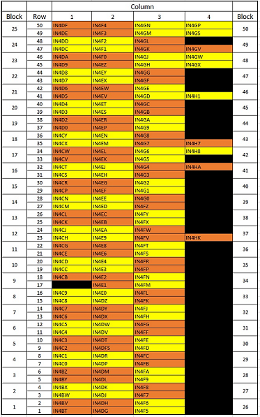
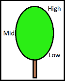

```{r setup, include=FALSE}
knitr::opts_chunk$set(echo = TRUE,cache = TRUE)
library(xlsx)
library(ggplot2)
library(gplots)
library(gridExtra)
library(corrplot)
library(dplyr)
library(png)
library(grid)
library(heatmaply)
```


### F1 Layout

Map indicates the layout of the F1 generation resulting from a cross between EC201 and EC103 parents. Column 1 is approximately lengthways facing north.

 


### Height Diagram

Diagram indicates the areas of leaf collection regarding height.
Each Tree had 10 leaves collected, 3 from Low, 4 from Mid and 3 from High. The first leaf sampled was measured twice for replication comparison.




### Import and Arrange Data

"Full.xlsx" contains measurement information from sampling with the Dualex (https://www.force-a.com/en/capteurs-optiques-optical-sensors/dualex-scientific-chlorophyll-meter/), including;

+ Surface content of chlorophyll in µg/cm² (Chl) 

+ The index of epidermal flavanols (Flav) 

+ Nitrogen Balance Index status (NBI)

+ Epidermal Anthocyanins (Anth). 

It also contains information about the block position, the leaf height information, and presense or absence of flowering


Sheet "Dup" contains only the samples that were replicated.

```{r}
# Import Data Measures
Data <-read.xlsx("Full.xlsx", sheetName ="Full")
head(Data)

# Import Replicate Data
Dup <-read.xlsx("Full.xlsx", sheetName ="Dup")
head(Dup)

#Isolate Crimson Glory Outgroup
CG = Data[c(1:11),]
head(CG)

#Isolate East Cape 201 Parent
EC201 = Data[c(12:21),]
head(EC201)

#Isolate East Cape 103 Parent
EC103 = Data[c(22:33),]
head(EC103)

#Isolate Offspring from the Parental Cross
F1 = Data[c(34:1825),]
head(F1)
```

### Checking Similarity of Replicates

Replicates were taken by measuring a leaf sample of each tree twice, in order to establish consistency and reliability of measurements with the Dualex.


```{r replicate comparison}
R <-group_by(Data,Rep.)
```

#### Replicate Means

```{r}
#Chlorophyll
RC = mean(R$Chl);RC
#Nitrogen Index
RN = mean(R$NBI);RN
#Anthocyanin
RA = mean(R$Anth);RA
#Flavanoids
RF = mean(R$Flav);RF
```

#### Replicate Plots

```{r}
plot<- ggplot(Dup) + aes(x = Rep., y = Chl) + geom_boxplot()+geom_hline(yintercept = RC)
plot2<- ggplot(Dup) + aes(x = Rep., y = NBI ) + geom_boxplot()+geom_hline(yintercept = RN)
plot3<- ggplot(Dup) + aes(x = Rep., y = Anth ) + geom_boxplot()+geom_hline(yintercept = RA)
plot4<- ggplot(Dup) + aes(x = Rep., y = Flav ) + geom_boxplot()+geom_hline(yintercept = RF)

grid.arrange(plot,plot2,plot3,plot4, ncol = 4)
```


#### ANOVA of Replicates

```{r}
#Chlorophyll
mod <-lm(Dup$Chl ~ Dup$Rep.)
anova(mod)
#Flavanol
mod2 <-lm(Dup$Flav ~ Dup$Rep.)
anova(mod2)
#Anthocyanin
mod3 <-lm(Dup$Anth ~ Dup$Rep.)
anova(mod3)
#Nitrogen
mod4 <-lm(Dup$NBI ~ Dup$Rep.)
anova(mod4)
```

The absence of statistically significant results indicates that our replicates are likely to be consistent.


### Comparing Allocations

Allocation refers to which group measurements were taken from, i.e. A Parental Tree (EC103, EC201), Outgroup Tree (CG), F1 Cross offspring

```{r Allocation}
AL <-group_by(Data,Allocation)
```

#### Measurement Means


```{r}
#Chlorophyll
AlC = mean(AL$Chl);AlC
#Nitrogen
AlN = mean(AL$NBI);AlN
#Flavanoids
AlF = mean(AL$Flav);AlF
#Anthocyanin
AlA = mean(AL$Anth);AlA
```


#### Boxplot comparing medians and measurement distributions

```{r}
plot5<- ggplot(Data) + aes(x = Allocation, y = Chl) + geom_boxplot()+geom_hline(yintercept = AlC)
plot6<- ggplot(Data) + aes(x = Allocation, y = NBI) + geom_boxplot()+geom_hline(yintercept = AlN)
plot7<- ggplot(Data) + aes(x = Allocation, y = Flav) + geom_boxplot()+geom_hline(yintercept = AlF)
plot8<- ggplot(Data) + aes(x = Allocation, y = Anth) + geom_boxplot()+geom_hline(yintercept = AlA)

grid.arrange(plot5,plot6,plot7,plot8, ncol=2)
```


#### ANOVAs

```{r}
#Chlorophyll
mod5 <-lm(Data$Chl ~ Data$Allocation)
anova(mod5)
#Nitrogen
mod6 <-lm(Data$NBI ~ Data$Allocation)
anova(mod5)
#Flavanol
mod7 <-lm(Data$Flav ~ Data$Allocation)
anova(mod7)
#Anthocyanin
mod8 <-lm(Data$Anth ~ Data$Allocation)
anova(mod8)
```

### Parental Cross Analysis (F1 Generation)

Investigating measures across the F1 cross population

```{r F1}
O <-group_by(F1,Tree.ID)
SO <-summarise(O,count = n(), Chl = mean(Chl,na.rm =T), NBI = mean(NBI, na.rm=T), Anth = mean(Anth, ra.rm = T), Flav = mean(Flav, na.rm = T));SO
```

### Surface Content of Chlorophyll (µg/cm²)


```{r Chl}
#Mean
OC <- mean(SO$Chl);OC
summary(SO$Chl)
summary(F1$Chl)
#Individual Tree Measures
plot15<-ggplot(SO) + aes(x = Tree.ID, y = Chl, group_by(Tree.ID)) + geom_boxplot() +geom_hline(yintercept = OC)

#Measure Distribution
plot16<-ggplot(SO) + aes(x = Chl) + geom_histogram(binwidth = 1);plot16
grid.arrange(plot15,plot16)

#ANOVA
ModChl <- lm(O$Chl ~ O$Tree.ID)
anova(ModChl)
```

#### Index of Epidermal Flavnols


```{r Flavanol Index}
OF <- mean(SO$Flav);OF

plot17<-ggplot(O) + aes(x = Tree.ID, y = Flav, xlab = "Tree") + geom_boxplot() +geom_hline(yintercept = OF);plot17
plot18 <-ggplot(O) + aes(x = Flav) + geom_histogram();plot18
grid.arrange(plot17,plot18)

ModFlav <- lm(O$Flav ~ O$Tree.ID)
anova(ModFlav)
```

#### Epidermal Anthocyanin


```{r}
OA <- mean(SO$Anth);OA

plot19<-ggplot(O) + aes(x = Tree.ID, y = Anth) + geom_boxplot() +geom_hline(yintercept = OA)
plot20<-ggplot(O) + aes(x = Anth) + geom_histogram()
grid.arrange(plot19,plot20)

ModAnth <- lm(O$Anth ~ O$Tree.ID)
anova(ModAnth)
```

#### Nitrogen Balance Index Status


```{r Nitro}
#Mean
ON <- mean(SO$NBI);ON

plot21<-ggplot(O) + aes(x = Tree.ID, y = NBI) + geom_boxplot() +geom_hline(yintercept = ON)
plot22<-ggplot(O) + aes(x = NBI) + geom_histogram()
grid.arrange(plot21,plot22)

ModNBI <- lm(O$NBI ~ O$Tree.ID)
anova(ModNBI)
```

#### Comparing Measures from the 3 height categories

Comparisons of measures between Low, Mid and High locations on trees.


```{r height variability}
Hgt <- group_by(F1, Height)
SHgt=summarise(Hgt, count = n(), Chl = mean(Chl,na.rm=T), NBI = mean(NBI, na.rm = T), Anth = mean(Anth, na.rm = T), Flav = mean(Flav, na.rm = T))

#Overall means across all heights
#Chlorophyll
HC = mean(SHgt$Chl);HC
#Nitrogen
HN = mean(SHgt$NBI);HN
#Anthocyanin
HA = mean(SHgt$Anth);HA
#Flavanoids
HF = mean(SHgt$Flav);HF

#Boxplots visualising height comparisons
plot23<-ggplot(Hgt) + aes(x = Height, y = NBI) + geom_boxplot()+geom_hline(yintercept = HN)
plot24<-ggplot(Hgt) + aes(x = Height, y = Chl) + geom_boxplot()+geom_hline(yintercept = HC)
plot25<-ggplot(Hgt) + aes(x = Height, y = Flav) + geom_boxplot()+geom_hline(yintercept = HF)
plot26<-ggplot(Hgt) + aes(x = Height, y = Anth) + geom_boxplot()+geom_hline(yintercept = HA)
grid.arrange(plot23,plot24,plot25,plot26,ncol=2)

#Visualising Measurement Distributions
plot231<-ggplot(Hgt) + aes(x = Chl) + geom_histogram()
plot241<-ggplot(Hgt) + aes(x = NBI) + geom_histogram()
plot251<-ggplot(Hgt) + aes(x = Flav) + geom_histogram()
plot261<-ggplot(Hgt) + aes(x = Anth) + geom_histogram()
grid.arrange(plot231,plot241,plot251,plot261)

#ANOVA
#Chlorophyll
FitH <- lm(Hgt$Chl ~ Hgt$Height)
anova(FitH)
#Nitrogen
FitH2 <- lm(Hgt$NBI ~ Hgt$Height)
anova(FitH2)
#Flavanoids
FitH3 <- lm(Hgt$Flav ~ Hgt$Height)
anova(FitH3)
#Anthocyanin
FitH4 <- lm(Hgt$Anth ~ Hgt$Height)
anova(FitH4)
```


#### Correlations Between Measures

Comparing correlations between the 4 dualex measures

```{r compare}
cor(Data[c(13:16)])

plot9 <-ggplot(F1) + aes(x = Chl, y = Anth) + geom_point()
plot10 <-ggplot(F1) + aes(x = NBI, y = Anth) + geom_point()
plot11<-ggplot(F1) + aes(x = Flav, y = Anth) + geom_point()
plot12<-ggplot(F1) + aes(x = NBI, y = Chl) + geom_point()
plot13<-ggplot(F1) + aes(x = Flav, y = Chl) + geom_point()
plot14<-ggplot(F1) + aes(x = Flav, y = NBI) + geom_point()
grid.arrange(plot9,plot10,plot11,plot12,plot13,plot14)

comp <-lm(Flav ~ Anth, data = F1)
anova(comp)

comp2 <-lm(NBI ~ Anth, data = F1)
anova(comp2)

comp3 <-lm(Flav ~ NBI, data = F1)
anova(comp3)

comp4 <-lm(Flav ~ Anth*NBI, data = F1)
anova(comp4)

comp5 <-lm(Anth ~ Flav*NBI, data = F1)
anova(comp5)

comp6 <-lm(NBI ~ Flav*Anth, data = F1)
anova(comp6)
```

#### Column Block Effects


```{r Column}
Cmn <- group_by(F1, Column)
SCmn <- summarise(Cmn, count =n(),Chl = mean(Chl,na.rm=T), NBI = mean(NBI, ra.nm = T), Anth = mean(Anth, na.rm=T),Flav = mean(Flav,na.rm =T))

CA = mean(SCmn$Anth);CA
CC = mean(SCmn$Chl);CC
CN = mean(SCmn$NBI);CN
CF = mean(SCmn$Flav);CF


plot27<-ggplot(F1) + aes(x = Column, y = Anth,group = Column) + geom_boxplot()+geom_hline(yintercept = CA)

plot28<-ggplot(F1) + aes(x = Column, y = Flav,group = Column) + geom_boxplot() +geom_hline(yintercept = CF)

plot29<-ggplot(F1) + aes(x = Column, y = NBI,group = Column) + geom_boxplot() +geom_hline(yintercept = CN)

plot30<-ggplot(F1) + aes(x = Column, y = Chl,group = Column) + geom_boxplot() +geom_hline(yintercept = CC)

grid.arrange(plot27,plot28,plot29,plot30)


Cmn$Column = as.factor(Cmn$Column)

Col <- lm(Cmn$Anth ~ Cmn$Column)
anova(Col)

Col2 <- lm(Cmn$Flav ~ Cmn$Column)
anova(Col2)

Col3 <- lm(Cmn$NBI ~ Cmn$Column)
anova(Col3)

Col4 <- lm(Cmn$Chl ~ Cmn$Column)
anova(Col4)
```

#### Row Block Effects

```{r Row}
Rw <-group_by(F1, Row)
SRw =summarise(Rw, count = n(), Chl = mean(Chl, na.rm=T),NBI = mean(NBI, na.rm=T), Flav = mean(Flav, na.rm = T), Anth = mean(Anth, na.rm=T))

#Means
#Chlorophyll
RwC = mean(SRw$Chl);RwC
#Anthocyanin
RwA = mean(SRw$Anth);RwA
#Flavanoid
RwF = mean(SRw$Flav);RwF
#Nitrogen
RwN = mean(SRw$NBI);RwN

#Comparing Tree Measures
plot31<-ggplot(Rw) + aes(x = Row, y = Chl, group = Row) + geom_boxplot()  +geom_hline(yintercept = RwC);plot31
plot32<-ggplot(Rw) + aes(x = Row, y = Anth, group = Row) + geom_boxplot() +geom_hline(yintercept = RwA);plot32
plot33<-ggplot(Rw) + aes(x = Row, y = Flav,group = Row) + geom_boxplot() +geom_hline(yintercept = RwF);plot33
plot34<-ggplot(Rw) + aes(x = Row, y = NBI, group = Row) + geom_boxplot() +geom_hline(yintercept = RwN);plot34

#ANOVA
#Anthocyanin
Ro <- lm(Rw$Anth ~ Rw$Row)
anova(Ro)

#Nitrogen
Ro2 <- lm(Rw$NBI ~ Rw$Row)
anova(Ro2)

#Flavanoids
Ro3 <- lm(Rw$Flav ~ Rw$Row)
anova(Ro3)

#Chlorophyll
Ro4 <- lm(Rw$Chl ~ Rw$Row)
anova(Ro4)
```

#### Block Effects, Combining Row and Columns. 

```{r Block}
Z = group_by(F1, Tree.ID,Row,Column)
Z1<- summarise(Z, count = n(), Chl = mean(Chl, na.rm=T),NBI = mean(NBI, na.rm=T), Flav = mean(Flav, na.rm = T), Anth = mean(Anth, na.rm=T))

```

ZChl = Z1[c(2,3,5)]
MChl = mean(ZChl$Chl);MChl
ZChl$Mean = ZChl$Chl-MChl
ZChl = ZChl[-c(3)]
write.xlsx(as.data.frame(ZChl), file = "Chl.xlsx", sheetName ="Chl",col.names = T, row.names = F)

ZNBI = Z1[c(2,3,6)]
MNBI = mean(ZNBI$NBI);MNBI
ZNBI$Mean = ZNBI$NBI-MNBI
ZNBI = ZNBI[-c(3)]
write.xlsx(as.data.frame(ZNBI), file = "NBI.xlsx", sheetName ="NBI",col.names = T, row.names = F)

ZFlav = Z1[c(2,3,7)]
MFlav = mean(ZFlav$Flav);MFlav
ZFlav$Mean = ZFlav$Flav-MFlav
ZFlav = ZFlav[-c(3)]
write.xlsx(as.data.frame(ZFlav), file = "Flav.xlsx", sheetName ="Flav",col.names = T, row.names = F)

ZAnth = Z1[c(2,3,8)]
MAnth = mean(ZAnth$Anth);MAnth
ZAnth$Mean = ZAnth$Anth-MAnth
ZAnth = ZAnth[-c(3)]
write.xlsx(as.data.frame(ZAnth), file = "Anth.xlsx", sheetName ="Anth",col.names = T, row.names = F)

```{r}

F1$Column = as.factor(F1$Column)

AnthDoc <-read.xlsx("Anth.xlsx", sheetName = "Anth")
heatmaply(AnthDoc, xlab = "Column",ylab ="Row", Rowv = FALSE, Colv = FALSE)
ARC <-lm(F1$Anth ~ F1$Row + F1$Column)
anova(ARC)

ARC2 <- lm(F1$Anth ~ F1$Row*F1$Column)
anova(ARC2)

ChlDoc<-read.xlsx("Chl.xlsx", sheetName = "Chl")
heatmaply(ChlDoc, xlab = "Column",ylab ="Row", Rowv = FALSE, Colv = FALSE)
CRC <-lm(F1$Chl ~ F1$Row + F1$Column)
anova(CRC)

CRC2 <- lm(F1$Chl ~ F1$Row*F1$Column)
anova(CRC2)

NBIDoc<-read.xlsx("NBI.xlsx", sheetName = "NBI")
heatmaply(NBIDoc, xlab = "Column",ylab ="Row", Rowv = FALSE, Colv = FALSE)
NRC <-lm(F1$NBI ~ F1$Row + F1$Column)
anova(NRC)

NRC2 <- lm(F1$NBI ~ F1$Row*F1$Column)
anova(NRC2)

FlavDoc<-read.xlsx("Flav.xlsx", sheetName = "Flav")
heatmaply(FlavDoc, xlab = "Column",ylab ="Row", Rowv = FALSE, Colv = FALSE)
FRC <-lm(F1$Flav ~ F1$Row + F1$Column)
anova(FRC)

FRC2 <- lm(F1$Flav ~ F1$Row*F1$Column)
anova(FRC2)
```

### Block and Height

```{r}
BHC <-lm(F1$Chl ~ F1$Row+F1$Column+F1$Height)
anova(BHC)

BHC2 <-lm(F1$Chl ~ F1$Row*F1$Column*F1$Height)
anova(BHC2)

BHF<-lm(F1$Flav ~ F1$Row+F1$Column+F1$Height)
anova(BHF)

BHF2 <-lm(F1$Flav ~ F1$Row*F1$Column*F1$Height)
anova(BHF2)

BHA<-lm(F1$Anth ~ F1$Row+F1$Column+F1$Height)
anova(BHA)

BHA2 <-lm(F1$Anth ~ F1$Row*F1$Column*F1$Height)
anova(BHA2)

BHN<-lm(F1$NBI ~ F1$Row+F1$Column+F1$Height)
anova(BHN)

BHN2 <-lm(F1$NBI ~ F1$Row*F1$Column*F1$Height)
anova(BHN2)
```


#### Compare Parents


```{r}
Parent <- rbind(EC201,EC103)
t.test(Parent$Chl ~ Parent$Tree.ID)
P1 <- lm(Parent$Chl ~ Parent$Tree.ID)
anova(P1)
t.test(Parent$Flav ~ Parent$Tree.ID)
P2 <-lm(Parent$Flav ~ Parent$Tree.ID)
anova(P2)
t.test(Parent$NBI ~ Parent$Tree.ID)
P3<- lm(Parent$NBI ~ Parent$Tree.ID)
anova(P3)
t.test(Parent$NBI ~ Parent$Tree.ID)
P4 <-lm(Parent$NBI ~ Parent$Tree.ID)
anova(P4)
```


#### Flowering

```{r}
plot35<- ggplot(F1) + aes(x = Flower, y = Chl) + geom_boxplot()
plot36<- ggplot(F1) + aes(x = Flower, y = NBI) + geom_boxplot()
plot37<- ggplot(F1) + aes(x = Flower, y = Flav) + geom_boxplot()
plot38<- ggplot(F1) + aes(x = Flower, y = Anth) + geom_boxplot()

grid.arrange(plot35,plot36,plot37,plot38)

CF<- lm(F1$Chl ~ F1$Flower)
anova(CF)

NF<- lm(F1$NBI ~ F1$Flower)
anova(NF)

FF<- lm(F1$Flav ~ F1$Flower)
anova(FF)

AF<- lm(F1$Anth ~ F1$Flower)
anova(AF)

CRF <- lm(F1$Anth ~ F1$Height*F1$Row*F1$Column)
anova(CRF)
```

#```{r}
Hdat <- read.xlsx("HeightData.xlsx", sheetName = "Phenotypes April 2018")
summary(Hdat$Height)
TH = (Hdat[c(1,4)])

Mrg <-group_by(F1,Tree.ID,Row,Column)
Mrg$Row = as.numeric(Mrg$Row)
summary(Mrg$Row)

Mrg <-summarise(Mrg,count = n(),Chl = mean(Chl,na.rm =T), NBI = mean(NBI, na.rm=T), Anth = mean(Anth, ra.rm = T), Flav = mean(Flav, na.rm = T))
View(Mrg)

TH$ID = TH$NA.
Mrg$ID = Mrg$Tree.ID

TH  = TH[-c(1)]
Mrg = Mrg[-c(1)]
View(Mrg)

EZ <- merge(TH,Mrg, all = FALSE)
View(EZ)
```


```{r}
Col <-group_by(F1,Tree.ID,Column)
Col <-summarise(Col, count = n(), Chl = mean(Chl,na.rm = T), Flav = mean(Flav, na.rm = T), NBI = mean(NBI, na.rm = T))

View(Col)
summary(Col)
Col$Column = as.factor(Col$Column)
ggplot(Col) + aes(x = Column, y = Chl) + geom_point()
```

###Accounting for Row, Column and Height means. 

```{r Environmental effects}
#Grouping F1 Data
CMean <-group_by(F1,Tree.ID,Column,Row,Height)
#Means
CMean <-summarise(CMean, Chl = mean(Chl,na.rm = T), Flav = mean(Flav, na.rm = T), NBI = mean(NBI, na.rm = T), Anth = mean(Anth,na.rm = T))
```
####Chlorophyll

####Comparing means between rows with 3 columns and 4 columns

```{r}
Dat <-read.xlsx("Z.xlsx", sheetName = "Sheet4")
View(Dat)
lmDat <-lm(Dat$Chl ~ Dat$Column.No.)
anova(lmDat)
```

```{r EChlorophyll}
ChlTab = CMean[c(1:4)]

#write.xlsx(as.data.frame(ChlTab), file = "ChlTab.xlsx", sheetName = "Chl", col.names = T)
ChlM2 <- read.xlsx("Z.xlsx", sheetName = "Row")

#Before Controlling for environmental effects

lm1<- lm(CMean$Chl ~ CMean$Column*CMean$Row*CMean$Height)
anova(lm1)

lm2 <- lm(CMean$Chl ~ CMean$Column)
anova(lm2)

lm2 <- lm(CMean$Chl ~ CMean$Row)
anova(lm2)

lm3 <- lm(CMean$Chl ~ CMean$Height)
anova(lm3)

#After controlling for row effects
lm2 <-lm(ChlM2$Chl ~ ChlM2$Row)
anova(lm2)

lm3 <-lm(ChlM2$Chl ~ ChlM2$Row*ChlM2$Column)
anova(lm3)

#Controlling Column effects
ChlM3 <- read.xlsx("Z.xlsx", sheetName = "Col")

lm4 <- lm(ChlM3$Chl ~ ChlM3$Column)
anova(lm4)

lm5 <-lm(ChlM3$Chl ~ ChlM3$Row)
anova(lm5)

lm6 <-lm(ChlM3$Chl ~ ChlM3$Column*ChlM3$Row)
anova(lm6)
```


```{r}
Dat <-read.xlsx("Z.xlsx", sheetName = "Sheet4")
View(Dat)
lmDat <-lm(Dat$Chl ~ Dat$Column.No.)
anova(lmDat)
```

####Anthocyanin

```{r EAnthocyanin}
AnthTab = CMean[c(1:4,8)]

#write.xlsx(as.data.frame(AnthTab), file = "AnthTab.xlsx", sheetName = "Anth", col.names = T)
AnthM2 <- read.xlsx("Z.xlsx", sheetName = "Row")

#Before Controlling for environmental effects

Anthlm1<- lm(CMean$Anth ~ CMean$Column*CMean$Row*CMean$Height)
anova(Anthlm1)

lm2 <- lm(CMean$Chl ~ CMean$Column)
anova(lm2)

lm2 <- lm(CMean$Chl ~ CMean$Row)
anova(lm2)

lm3 <- lm(CMean$Chl ~ CMean$Height)
anova(lm3)

#After controlling for Height effects
AnthM2 <- read.xlsx("MAnth.xlsx", sheetName = "Height")

Anthlm2 <-lm(AnthM2$Anth ~ AnthM2$Height)
anova(Anthlm2)

CAnth <-group_by(CMean,Tree.ID,Column,Row)
CAnth <-summarise(CMean, Chl = mean(Chl,na.rm = T), Flav = mean(Flav, na.rm = T), NBI = mean(NBI, na.rm = T), Anth = mean(Anth,na.rm = T))

write.xlsx(as.data.frame(CAnth), file = "AnthT.xlsx", sheetName = "Anth", col.names = T)

#Controlling Row effects
AnthM2 <- read.xlsx("MAnth.xlsx", sheetName = "Row")

Anthlm4 <- lm(AnthM2$Anth ~ AnthM2$Row)
anova(Anthlm4)

Anthlm5 <-lm(AnthM2$Anth ~ AnthM2$Row*AnthM2$Column)
anova(Anthlm5)

#Controlling Column effects
AnthM4 <- read.xlsx("MAnth.xlsx", sheetName = "Col")
Anthlm6 <-lm(AnthM4$Anth ~ AnthM4$Column)
anova(Anthlm6)

Anth7 <-lm(AnthM4$Anth ~ AnthM4$Column*AnthM4$Row)
anova(Anth7)
```

```{r EFlavanol}
AnthTab = CMean[c(1:4,8)]

write.xlsx(as.data.frame(FlavTab), file = "AnthTab.xlsx", sheetName = "Anth", col.names = T)
AnthM2 <- read.xlsx("Z.xlsx", sheetName = "Row")

#Before Controlling for environmental effects

Anthlm1<- lm(CMean$Anth ~ CMean$Column*CMean$Row*CMean$Height)
anova(Anthlm1)

lm2 <- lm(CMean$Chl ~ CMean$Column)
anova(lm2)

lm2 <- lm(CMean$Chl ~ CMean$Row)
anova(lm2)

lm3 <- lm(CMean$Chl ~ CMean$Height)
anova(lm3)

#After controlling for Height effects
AnthM2 <- read.xlsx("MAnth.xlsx", sheetName = "Height")

Anthlm2 <-lm(AnthM2$Anth ~ AnthM2$Height)
anova(Anthlm2)

CAnth <-group_by(CMean,Tree.ID,Column,Row)
CAnth <-summarise(CMean, Chl = mean(Chl,na.rm = T), Flav = mean(Flav, na.rm = T), NBI = mean(NBI, na.rm = T), Anth = mean(Anth,na.rm = T))

write.xlsx(as.data.frame(CAnth), file = "AnthT.xlsx", sheetName = "Anth", col.names = T)

#Controlling Row effects
AnthM2 <- read.xlsx("MAnth.xlsx", sheetName = "Row")

Anthlm4 <- lm(AnthM2$Anth ~ AnthM2$Row)
anova(Anthlm4)

Anthlm5 <-lm(AnthM2$Anth ~ AnthM2$Row*AnthM2$Column)
anova(Anthlm5)

#Controlling Column effects
AnthM4 <- read.xlsx("MAnth.xlsx", sheetName = "Col")
Anthlm6 <-lm(AnthM4$Anth ~ AnthM4$Column)
anova(Anthlm6)

Anth7 <-lm(AnthM4$Anth ~ AnthM4$Column*AnthM4$Row)
anova(Anth7)
```
