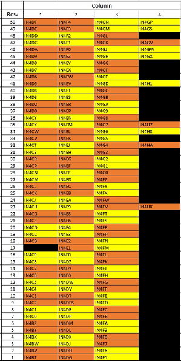

```{r setup, include=FALSE}
knitr::opts_chunk$set(echo = TRUE,cache = TRUE, fig.align = "centre")
library(xlsx)
library(ggplot2)
library(gplots)
library(gridExtra)
library(corrplot)
library(dplyr)
library(png)
library(grid)
library(heatmaply)
```


### F1 Layout

Map indicates the layout of the F1 generation resulting from a cross between EC201 and EC103 parents.

 


### Height Diagram

Diagram indicates the areas of leaf collection regarding height.
Each Tree had 10 leaves collected, 3 from Low, 4 from Mid and 3 from High. The first leaf sampled was measured twice for replication comparison.


### Import and Arrange Data
"Full.xlsx" contains measurement information from sampling. 
Sheet "Dup" contains only the repeated leaf measures

```{r}
# Import Data Measures
Data <-read.xlsx("Full.xlsx", sheetName ="Full")
head(Data)

# Import Replicate Data
Dup <-read.xlsx("Full.xlsx", sheetName ="Dup")
head(Data)

#Isolate Crimson Glory Outgroup
CG = Data[c(1:11),]
head(CG)

#Isolate East Cape 201 Parent
EC201 = Data[c(12:21),]
head(EC201)

#Isolate East Cape 103 Parent
EC103 = Data[c(22:33),]
head(EC103)

#Isolate Offspring from Parental Cross
F1 = Data[c(34:1825),]
head(F1)
```

### Checking Similarity of Replicates

Replicates were taken by measuring the first leaf sample of a tree twice, in order to establish consistency and reliability of measurements


```{r replicate comparison}
R <-group_by(Data,Rep.)
SR <-summarise(R,count = n(), Chl = mean(Chl,na.rm =T), NBI = mean(NBI, na.rm=T), Anth = mean(Anth, ra.rm = T), Flav = mean(Flav, na.rm = T))

#Mean Calculations Across All Replicate Measures
#Chlorophyll
RC = mean(SR$Chl);RC
#Nitrogen Index
RN = mean(SR$NBI);RN
#Anthocyanin
RA = mean(SR$Anth);RA
#Flavanoids
RF = mean(SR$Flav);RF

#Plots of Replicate Group Medians and Distributions
plot<- ggplot(Dup) + aes(x = Rep., y = Chl ) + geom_boxplot()+geom_hline(yintercept = RC)
plot2<- ggplot(Dup) + aes(x = Rep., y = NBI ) + geom_boxplot()+geom_hline(yintercept = RN)
plot3<- ggplot(Dup) + aes(x = Rep., y = Anth ) + geom_boxplot()+geom_hline(yintercept = RA)
plot4<- ggplot(Dup) + aes(x = Rep., y = Flav ) + geom_boxplot()+geom_hline(yintercept = RF)

grid.arrange(plot,plot2,plot3,plot4, ncol = 4)

#ANOVA
#Chlorophyll
mod <-lm(Dup$Chl ~ Dup$Rep.)
anova(mod)
#Flavanol
mod2 <-lm(Dup$Flav ~ Dup$Rep.)
anova(mod2)
#Anthocyanin
mod3 <-lm(Dup$Anth ~ Dup$Rep.)
anova(mod3)
#Nitrogen
mod4 <-lm(Dup$NBI ~ Dup$Rep.)
anova(mod4)
```

#### Comparing Allocations

Allocation refers to which group measurements were taken from, i.e. Parental Tree (EC103, EC201), Outgroup Tree (CG), F1 Cross offspring

```{r Allocation}
Al <-group_by(Data,Allocation)
SAL <-summarise(Al,count = n(), Chl = mean(Chl,na.rm =T), NBI = mean(NBI, na.rm=T), Anth = mean(Anth, ra.rm = T), Flav = mean(Flav, na.rm = T))

#Mean Calculations Across all Allocations
#Chlorophyll
AlC = mean(SAL$Chl);AlC
#Nitrogen
AlN = mean(SAL$NBI);AlN
#Flavanoids
AlF = mean(SAL$Flav);AlF
#Anthocyanin
AlA = mean(SAL$Anth);AlA

#Boxplot comparing medians and measurement distributions
plot5<- ggplot(Data) + aes(x = Allocation, y = Chl) + geom_boxplot()+geom_hline(yintercept = AlC)
plot6<- ggplot(Data) + aes(x = Allocation, y = NBI) + geom_boxplot()+geom_hline(yintercept = AlN)
plot7<- ggplot(Data) + aes(x = Allocation, y = Flav) + geom_boxplot()+geom_hline(yintercept = AlF)
plot8<- ggplot(Data) + aes(x = Allocation, y = Anth) + geom_boxplot()+geom_hline(yintercept = AlA)

grid.arrange(plot5,plot6,plot7,plot8, ncol=2)

#ANOVAs
#Chlorophyll
mod5 <-lm(Data$Chl ~ Data$Allocation)
anova(mod5)
#Nitrogen
mod6 <-lm(Data$NBI ~ Data$Allocation)
anova(mod5)
#Flavanol
mod7 <-lm(Data$Flav ~ Data$Allocation)
anova(mod7)
#Anthocyanin
mod8 <-lm(Data$Anth ~ Data$Allocation)
anova(mod8)
```

## F1 Trees

Investigating measures across the F1 cross population

```{r F1}
O <-group_by(F1,Tree.ID)
SO <-summarise(O,count = n(), Chl = mean(Chl,na.rm =T), NBI = mean(NBI, na.rm=T), Anth = mean(Anth, ra.rm = T), Flav = mean(Flav, na.rm = T));SO
```

### Chlorophyll


```{r Chl}
#Mean
OC <- mean(SO$Chl);OC

#Individual Tree Measures
plot15<-ggplot(O) + aes(x = Tree.ID, y = Chl, group_by(Tree.ID)) + geom_boxplot() +geom_hline(yintercept = OC)

#Measure Distribution
plot16<-ggplot(O) + aes(x = Chl) + geom_histogram()
grid.arrange(plot15,plot16)

#ANOVA
ModChl <- lm(O$Chl ~ O$Tree.ID)
anova(ModChl)
```

## Flavanol


```{r Flavanol Index}
OF <- mean(SO$Flav);OF

plot17<-ggplot(O) + aes(x = Tree.ID, y = Flav) + geom_boxplot() +geom_hline(yintercept = OF)
plot18 <-ggplot(O) + aes(x = Flav) + geom_histogram()
grid.arrange(plot17,plot18)

ModFlav <- lm(O$Flav ~ O$Tree.ID)
anova(ModFlav)
```

## Anthocyanin


```{r}
OA <- mean(SO$Anth);OA

plot19<-ggplot(O) + aes(x = Tree.ID, y = Anth) + geom_boxplot() +geom_hline(yintercept = OA)
plot20<-ggplot(O) + aes(x = Anth) + geom_histogram()
grid.arrange(plot19,plot20)

ModAnth <- lm(O$Anth ~ O$Tree.ID)
anova(ModAnth)
```

## Nitrogen Status


```{r Nitro}
#Mean
ON <- mean(SO$NBI);ON

plot21<-ggplot(O) + aes(x = Tree.ID, y = NBI) + geom_boxplot() +geom_hline(yintercept = ON)
plot22<-ggplot(O) + aes(x = NBI) + geom_histogram()
grid.arrange(plot21,plot22)

ModNBI <- lm(O$NBI ~ O$Tree.ID)
anova(ModNBI)
```

#### Comparing Measures from the 3 height categories


```{r height variability}
Hgt <- group_by(F1, Height)
SHgt=summarise(Hgt, count = n(), Chl = mean(Chl,na.rm=T), NBI = mean(NBI, na.rm = T), Anth = mean(Anth, na.rm = T), Flav = mean(Flav, na.rm = T))

#Overall means across all heights
#Chlorophyll
HC = mean(SHgt$Chl);HC
#Nitrogen
HN = mean(SHgt$NBI);HN
#Anthocyanin
HA = mean(SHgt$Anth);HA
#Flavanoids
HF = mean(SHgt$Flav);HF

#Boxplots visualising height comparisons
plot23<-ggplot(Hgt) + aes(x = Height, y = NBI) + geom_boxplot()+geom_hline(yintercept = HN)
plot24<-ggplot(Hgt) + aes(x = Height, y = Chl) + geom_boxplot()+geom_hline(yintercept = HC)
plot25<-ggplot(Hgt) + aes(x = Height, y = Flav) + geom_boxplot()+geom_hline(yintercept = HF)
plot26<-ggplot(Hgt) + aes(x = Height, y = Anth) + geom_boxplot()+geom_hline(yintercept = HA)
grid.arrange(plot23,plot24,plot25,plot26,ncol=2)

#Visualising Measurement Distributions
plot231<-ggplot(Hgt) + aes(x = Chl) + geom_histogram()
plot241<-ggplot(Hgt) + aes(x = NBI) + geom_histogram()
plot251<-ggplot(Hgt) + aes(x = Flav) + geom_histogram()
plot261<-ggplot(Hgt) + aes(x = Anth) + geom_histogram()
grid.arrange(plot231,plot241,plot251,plot261)

#ANOVA
#Chlorophyll
FitH <- lm(Hgt$Chl ~ Hgt$Height)
anova(FitH)
#Nitrogen
FitH2 <- lm(Hgt$NBI ~ Hgt$Height)
anova(FitH2)
#Flavanoids
FitH3 <- lm(Hgt$Flav ~ Hgt$Height)
anova(FitH3)
#Anthocyanin
FitH4 <- lm(Hgt$Anth ~ Hgt$Height)
anova(FitH4)
```


#### Correlations Between Measures
Comparing correlations between the various measures

```{r compare}
Data2 = Data[c(12:15)]
cor(Data2)

plot9 <-ggplot(F1) + aes(x = Chl, y = Anth) + geom_point()
plot10 <-ggplot(F1) + aes(x = NBI, y = Anth) + geom_point()
plot11<-ggplot(F1) + aes(x = Flav, y = Anth) + geom_point()
plot12<-ggplot(F1) + aes(x = NBI, y = Chl) + geom_point()
plot13<-ggplot(F1) + aes(x = Flav, y = Chl) + geom_point()
plot14<-ggplot(F1) + aes(x = Flav, y = NBI) + geom_point()
grid.arrange(plot9,plot10,plot11,plot12,plot13,plot14)

comp <-lm(Flav ~ Anth, data = F1)
anova(comp)

comp2 <-lm(NBI ~ Anth, data = F1)
anova(comp2)

comp3 <-lm(Flav ~ NBI, data = F1)
anova(comp3)

comp4 <-lm(Flav ~ Anth+NBI, data = F1)
anova(comp4)

comp5 <-lm(Anth ~ Flav + NBI, data = F1)
anova(comp5)

comp6 <-lm(NBI ~ Flav + Anth, data = F1)
anova(comp6)
```

#### Column Block Effects


```{r Column}
Cmn <- group_by(F1, Column)
SCmn <- summarise(Cmn, count =n(),Chl = mean(Chl,na.rm=T), NBI = mean(NBI, ra.nm = T), Anth = mean(Anth, na.rm=T),Flav = mean(Flav,na.rm =T))

CA = mean(SCmn$Anth);CA
CC = mean(SCmn$Chl);CC
CN = mean(SCmn$NBI);CN
CF = mean(SCmn$Flav);CF


plot27<-ggplot(F1) + aes(x = Column, y = Anth,group = Column) + geom_boxplot()+geom_hline(yintercept = CA)

plot28<-ggplot(F1) + aes(x = Column, y = Flav,group = Column) + geom_boxplot() +geom_hline(yintercept = CF)

plot29<-ggplot(F1) + aes(x = Column, y = NBI,group = Column) + geom_boxplot() +geom_hline(yintercept = CN)

plot30<-ggplot(F1) + aes(x = Column, y = Chl,group = Column) + geom_boxplot() +geom_hline(yintercept = CC)

grid.arrange(plot27,plot28,plot29,plot30)

Col <- lm(Cmn$Anth ~ Cmn$Column)
anova(Col)

Col2 <- lm(Cmn$Flav ~ Cmn$Column)
anova(Col2)

Col3 <- lm(Cmn$NBI ~ Cmn$Column)
anova(Col3)

Col4 <- lm(Cmn$Chl ~ Cmn$Column)
anova(Col4)
```

#### Row Block Effects

```{r Row}
Rw <-group_by(F1, Row)
SRw =summarise(Rw, count = n(), Chl = mean(Chl, na.rm=T),NBI = mean(NBI, na.rm=T), Flav = mean(Flav, na.rm = T), Anth = mean(Anth, na.rm=T))

#Means
#Chlorophyll
RwC = mean(SRw$Chl);RwC
#Anthocyanin
RwA = mean(SRw$Anth);RwA
#Flavanoid
RwF = mean(SRw$Flav);RwF
#Nitrogen
RwN = mean(SRw$NBI);RwN

#Comparing Tree Measures
plot31<-ggplot(Rw) + aes(x = Row, y = Chl, group = Row) + geom_boxplot()  +geom_hline(yintercept = RwC);plot31
plot32<-ggplot(Rw) + aes(x = Row, y = Anth, group = Row) + geom_boxplot() +geom_hline(yintercept = RwA);plot32
plot33<-ggplot(Rw) + aes(x = Row, y = Flav,group = Row) + geom_boxplot() +geom_hline(yintercept = RwF);plot33
plot34<-ggplot(Rw) + aes(x = Row, y = NBI, group = Row) + geom_boxplot() +geom_hline(yintercept = RwN);plot34

#ANOVA
#Anthocyanin
Ro <- lm(Rw$Anth ~ Rw$Row)
anova(Ro)

#Nitrogen
Ro2 <- lm(Rw$NBI ~ Rw$Row)
anova(Ro2)

#Flavanoids
Ro3 <- lm(Rw$Flav ~ Rw$Row)
anova(Ro3)

#Chlorophyll
Ro4 <- lm(Rw$Chl ~ Rw$Row)
anova(Ro4)
```

#### Block Effects, Combining Row and Columns. 

```{r Block}
CRC <-lm(F1$Chl ~ F1$Row + F1$Column)
anova(CRC)

Z = group_by(F1, Tree.ID,Row,Column)
Z1<- summarise(Z, count = n(), Chl = mean(Chl, na.rm=T),NBI = mean(NBI, na.rm=T), Flav = mean(Flav, na.rm = T), Anth = mean(Anth, na.rm=T))

ZChl = Z1[c(2,3,5)]
write.xlsx(as.data.frame(ZChl), file = "Chl.xlsx", sheetName ="Chl",col.names = T, row.names = F)

ZNBI = Z1[c(2,3,6)]
write.xlsx(as.data.frame(ZNBI), file = "NBI.xlsx", sheetName ="NBI",col.names = T, row.names = F)

ZFlav = Z1[c(2,3,7)]
write.xlsx(as.data.frame(ZFlav), file = "Flav.xlsx", sheetName ="Flav",col.names = T, row.names = F)

ZAnth = Z1[c(2,3,8)]
write.xlsx(as.data.frame(ZAnth), file = "Anth.xlsx", sheetName ="Anth",col.names = T, row.names = F)

#heatmaply(Z1C)


```

### Block and Height

```{r}
BHC <-lm(F1$Chl ~ F1$Block+F1$Height)
anova(BHC)

BHF<-lm(F1$Flav ~ F1$Block+F1$Height)
anova(BHF)

BHA<-lm(F1$Anth ~ F1$Block+F1$Height)
anova(BHA)

BHN<-lm(F1$NBI ~ F1$Block+F1$Height)
anova(BHN)
```


#### Compare Parents


```{r}
Parent <- rbind(EC201,EC103)
t.test(Parent$Chl ~ Parent$Tree.ID)
P1 <- lm(Parent$Chl ~ Parent$Tree.ID)
anova(P1)
t.test(Parent$Flav ~ Parent$Tree.ID)
P2 <-lm(Parent$Flav ~ Parent$Tree.ID)
anova(P2)
t.test(Parent$NBI ~ Parent$Tree.ID)
P3<- lm(Parent$NBI ~ Parent$Tree.ID)
anova(P3)
t.test(Parent$NBI ~ Parent$Tree.ID)
P4 <-lm(Parent$NBI ~ Parent$Tree.ID)
anova(P4)
```