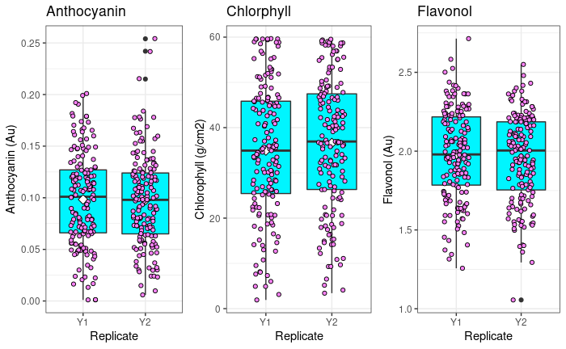
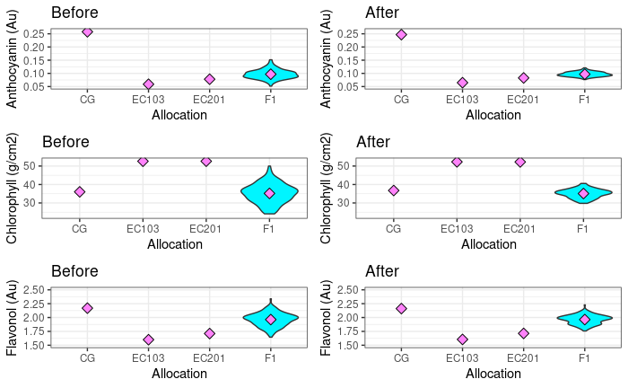

```{r setup, include=FALSE}
knitr::opts_chunk$set(echo = FALSE, cache = TRUE, message = FALSE, warning = FALSE)
library(xlsx)
library(ggplot2)
library(gplots)
library(gridExtra)
library(corrplot)
library(plyr)
library(dplyr)
library(png)
library(grid)
library(heatmaply)
library(lme4)
library(MCMCglmm)
library(tidyverse)
library(broom)
library(nadiv)
library("glmnet") 
library("caret")
library("ggcorrplot")
library(factoextra)
library(fpc)
```

[Mānuka Background]

[Methods]

[Replicates]

[Environmental Effects]

[Probably some QTL shit ]

#### Mānuka Background

Mānuka background(cultural,uses,industry)

Experimental Cross Design

Two east cape parents, F1 cross siblings 

#### Methods

Two parental trees from the East Cape region of New Zealand were bred together to produce a full sibling F1 generation, all of which are located at Plant and Food Research in Palmerston North. All of the trees have undergone full genome sequences and markers developed and mapped. 

Using a leaf spectrometer called a [Dualex](https://www.force-a.com/products/dualex), spectral information was collected for 151 F1 samples, the parents and a an outgroup crimson glory. 

#### F1 Trees

The results from a cross of two East Cape parents, the F1 generation of Mānuka are located at Plant and Food reasearch, Palmerston North in 50 rows and 4 columns, with column 1 being north facing. 


#### Height Diagram

Diagram indicates the areas of leaf collection regarding height.
Each Tree generally had 10 leaves collected (some trees have been sampled more than once), leaves were selected from low, mid and high points of the tree. The first leaf sampled from each tree was measured twice for replication comparison.


#### Replicates 



for more indepth replicate analyses follow the link;

[Replicate Analysis](./ReplicateAnalysis.html)


#### Environmental Effects




[Environmental Adjustment Rmarkdown](./EnvironmentalAdjustments.html)

#### Probably some QTL shit 

do analysis ... 


